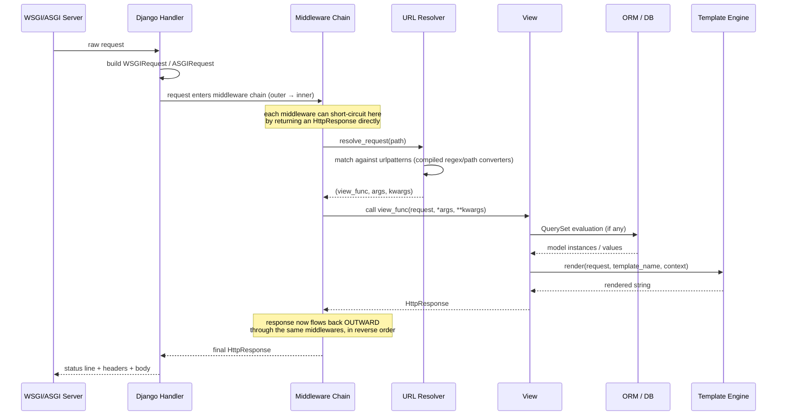
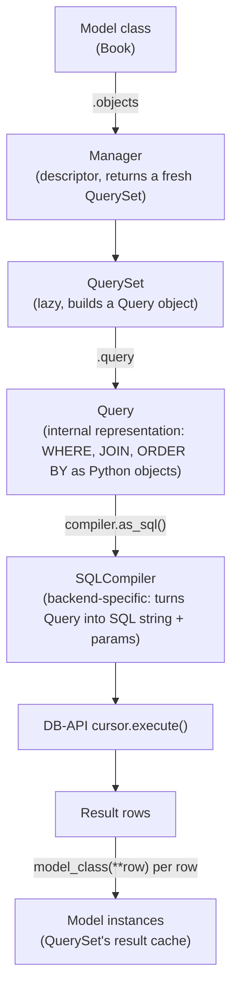
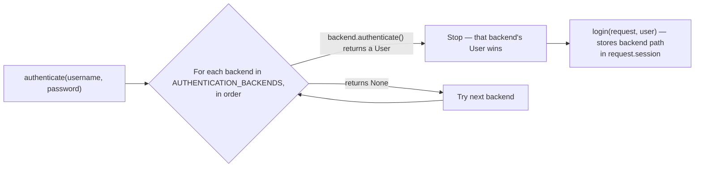

# Django Architecture — The Senior Engineer's Field Guide

> This is not an introduction. It assumes you already know Django's public API — `models.Model`, `views.py`, `urls.py`, `manage.py runserver`. What it covers instead: **why Django is built the way it is, what actually happens under each API call, and how the pieces are meant to compose.** Understanding this is what separates "I can build a CRUD app in Django" from "I know exactly what tool I'm holding and when to reach for something else." Checked against Django 6.0.7 (current LTS-adjacent release as of July 2026).

---

## Table of Contents

1. [The Core Design Philosophy](#philosophy)
2. [The Request/Response Lifecycle, End to End](#lifecycle)
3. [The App Registry & Settings System](#apps)
4. [Middleware — The Onion Model](#middleware)
5. [URL Dispatching Internals](#urls)
6. [Views — What `as_view()` Actually Does](#views)
7. [The ORM — Full Architecture](#orm)
8. [Forms — The Cleaning Pipeline](#forms)
9. [Templates — Engine Architecture](#templates)
10. [Signals — The Dispatcher Pattern](#signals)
11. [Auth & Permissions Architecture](#auth)
12. [Caching Framework Architecture](#cache)
13. [Sessions Architecture](#sessions)
14. [The Admin Is Not Magic](#admin)
15. [Testing Architecture](#testing)
16. [Async Django — What's Real and What's Not](#async)
17. [Deployment Architecture](#deployment)
18. [Design Principles, Distilled](#principles)
19. [Anti-Patterns a Senior Engineer Recognizes on Sight](#antipatterns)
20. [Mental Model Cheat Sheet](#cheatsheet)

---

## 1. The Core Design Philosophy {#philosophy}

Django is not "a set of tools for building websites." It's an implementation of a specific set of opinions, and every module makes more sense once you know the opinions:

- **Explicit is better than implicit, except where convention removes real toil.** Django doesn't autodiscover your routes by inspecting decorators scattered across files (contrast Flask/FastAPI) — you write `urls.py` explicitly. But it *does* autodiscover `admin.py`, `apps.py`, and migrations, because those are structural, not business logic. The line Django draws: **convention governs plumbing, explicitness governs behavior.**
- **Loose coupling through the "app" as the unit of reuse.** A Django "app" (in `INSTALLED_APPS`) is meant to be a self-contained, potentially-reusable component — its own models, its own templates, its own migrations, its own tests — that doesn't assume the existence of any other app. This is why `django.contrib.auth`, `django.contrib.admin`, and `django.contrib.sessions` ship as separate apps instead of framework internals: they're dogfooding the same reuse mechanism you're supposed to use for your own domains.
- **The framework provides defaults, not mandates.** Nearly every core class is designed to be subclassed and overridden at a specific extension point (`AppConfig.ready()`, custom `Manager`s, custom `Field`s, adapters, backends, middleware). Django's real skill ceiling is knowing *where* the extension points are, not memorizing the default behavior.
- **The database is a first-class citizen, not an implementation detail.** The ORM does not try to hide SQL from you — it tries to make the common 80% of SQL generation declarative while leaving an honest escape hatch (`.raw()`, `.extra()` [deprecated], `connection.cursor()`, custom `Func`/`Expression` classes) for the rest. Senior-level Django means reading `.query` output and reasoning about the actual SQL, not treating the ORM as an opaque black box.

Django's shape is MTV (Model-Template-View), which is MVC with the controller responsibility split between Django's URL resolver + view (controller) and the "View" name applied to what MVC calls the "View" (Django's "Template"). This naming has confused a generation of engineers coming from Rails — internalize it once and move on.

---

## 2. The Request/Response Lifecycle, End to End {#lifecycle}

Every Django request — WSGI or ASGI — goes through the same conceptual pipeline. This is the single most important diagram to have memorized, because nearly every architectural decision in your app (where to put a permission check, where to put a cross-cutting concern, where to catch an exception) reduces to "which stage does this belong in."



**What most engineers get wrong about this diagram:** they think of middleware as "stuff that runs before the view." It's more accurate to think of middleware as **concentric layers wrapping the view**, each layer getting to touch both the inbound request and the outbound response. `process_request` (implicit, via `__call__`) runs going in; `process_response` (also implicit) runs going out, **in reverse order**. `process_exception` only fires if the view raised. `process_view` fires after URL resolution but before the view executes, which is the one hook that can see both the resolved view function and its arguments — the correct place for "does this specific view need special handling" logic that doesn't belong in the view itself.

This is also why middleware order in `MIDDLEWARE` matters more than most people account for: `SecurityMiddleware` needs to run before anything that trusts `request.is_secure()`; `SessionMiddleware` must run before `AuthenticationMiddleware` because auth reads `request.session`; `AuthenticationMiddleware` must run before anything that reads `request.user`. The list is a literal onion, outer-to-inner on the way in.

**Under ASGI**, the same conceptual pipeline holds, but each layer can be sync or async, and Django inserts sync/async adapters (`sync_to_async`/`async_to_sync`) automatically at each boundary where a sync component meets an async one. This adaptation isn't free — every boundary crossing has real overhead (a thread-pool hop) — which is why a fully-async request path (async middleware → async view → async ORM calls) is meaningfully faster under load than a mixed one.

---

## 3. The App Registry & Settings System {#apps}

`INSTALLED_APPS` is not a list Django glances at once. It drives a two-phase boot sequence via `django.apps.apps` (the app registry, a singleton):

1. **`populate()` phase 1 — import app configs.** For each entry in `INSTALLED_APPS`, Django imports the app's `apps.py` (or synthesizes a default `AppConfig` if none exists) and instantiates it. At this point, **no models are usable yet.**
2. **`populate()` phase 2 — import all models.** Django imports every app's `models` module. This is why cross-app model imports at module level can create circular-import failures if you're not careful — model classes need to exist before any app's `ready()` can safely reference them.
3. **`populate()` phase 3 — call `AppConfig.ready()` on every app, in `INSTALLED_APPS` order.** This is the officially sanctioned place to register signal receivers, monkey-patch (rare, be careful), or do any one-time app-wiring — **not** at module import time in `models.py`, because model modules get imported before the registry is fully populated and signal receiver registration during import can silently miss models that get imported later.

```python
# myapp/apps.py
from django.apps import AppConfig

class MyAppConfig(AppConfig):
    default_auto_field = "django.db.models.BigAutoField"
    name = "myapp"

    def ready(self):
        # Correct place for signal wiring — the registry is fully populated here.
        from . import signals  # noqa
```

**Settings are a lazy singleton, not a dict.** `django.conf.settings` is a `LazySettings` object — it doesn't actually load `DJANGO_SETTINGS_MODULE` until the first attribute access, which is why you can safely `import django.conf.settings` from anywhere without worrying about import order, but also why a broken setting sometimes doesn't surface as an error until deep into a request rather than at process start.

**The system checks framework** (`python manage.py check`, and automatically run before `migrate`/`runserver`) is Django's static-analysis layer — it's how the framework catches "you defined a `ForeignKey` without `on_delete`" or "your `ModelAdmin` references a field that doesn't exist" before you ever hit a runtime error. Senior-level habit: register your own checks (`django.core.checks.register`) for invariants specific to your domain (e.g., "every `Organization` must have exactly one `is_default=True` `Plan`") instead of relying on tests alone to catch structural mistakes.

---

## 4. Middleware — The Onion Model {#middleware}

A middleware is, at its core, a callable that wraps another callable:

```python
class TimingMiddleware:
    def __init__(self, get_response):
        self.get_response = get_response   # the next layer in

    def __call__(self, request):
        start = time.monotonic()
        response = self.get_response(request)     # <- descends inward, all the way to the view
        response["X-Response-Time-Ms"] = int((time.monotonic() - start) * 1000)
        return response
```

That's the entire mental model. `process_view`, `process_exception`, and `process_template_response` are optional methods Django looks for and calls at specific points, but the `__init__`/`__call__` pair is the only thing structurally required. Understanding this makes it obvious why middleware is the right tool for **cross-cutting, request-agnostic concerns** (timing, request-ID injection, security headers, GZip, forcing HTTPS) and the wrong tool for **anything that needs to know which specific view/model is involved** (that belongs in a decorator, a `View` mixin, or a permission class) — middleware runs for *every* request whether or not it's relevant, so putting view-specific logic there means writing your own dispatch table by hand, badly, when Django's URL resolver already does that job.

**Middleware vs. decorators vs. signals vs. context processors** — the decision matrix a senior engineer actually uses:

| Mechanism | Runs for | Best for |
|---|---|---|
| Middleware | Every request, before URL resolution knows what view it is | Global concerns: security headers, request logging, auth session loading, GZip |
| View decorator / `View` mixin | One specific view or a family of views | Per-view concerns: rate limiting a specific endpoint, requiring a specific permission |
| Signal receiver | Whenever a specific model/framework event fires, regardless of what triggered it | Decoupled side effects across app boundaries (e.g., app B reacts to app A's model save without A knowing B exists) |
| Context processor | Every template render (not every request — only template-rendering ones) | Injecting the same variable into every template's context (e.g., `request`, feature flags, site settings) |

---

## 5. URL Dispatching Internals {#urls}

`urlpatterns` isn't a routing table Django scans linearly forever — it's compiled once into a `URLResolver` tree. Each `path()`/`re_path()` call produces a `URLPattern`; each `include()` produces a nested `URLResolver`. Resolution is depth-first: Django walks the tree, trying each pattern's regex (path converters like `<int:pk>` compile down to named regex groups under the hood) until one matches the remaining path, then hands off the *remaining unmatched suffix* to the next nested resolver if it's an `include()`.

```python
urlpatterns = [
    path("api/", include("myapp.api_urls")),   # this creates a nested URLResolver
]
```

**`reverse()` and `` are not string formatting — they're the resolver run backward.** Django builds a reverse lookup dict keyed by URL name (and namespace) at first use, mapping names back to the pattern needed to reconstruct a matching path. This is precisely why hardcoding URLs in templates/views is an anti-pattern with teeth: change a `path()`'s route string and every hardcoded reference silently breaks, while every `reverse()`/`` call keeps working.

**Namespacing (`app_name` + `namespace=` in `include()`)** exists because Django apps are meant to be reusable — if two installed apps both define a URL named `detail`, namespacing is what lets `reverse("blog:detail")` and `reverse("shop:detail")` coexist. If you're not namespacing your app URLs, you're implicitly assuming your project will never install two apps with overlapping URL names — a bet that gets worse the bigger the codebase gets.

---

## 6. Views — What `as_view()` Actually Does {#views}

Function-based views are just callables: `def my_view(request, *args, **kwargs) -> HttpResponse`. Nothing more to know architecturally.

Class-based views are more interesting, and this is where most engineers stop understanding what's actually happening. `MyView.as_view()` doesn't return an instance — **it returns a closure (`view` function) that Django's URL resolver treats exactly like a function-based view.** Each incoming request gets a *fresh instance* of your class (this is why CBVs are safe from shared mutable state between requests — no singleton lurking):

```python
# Simplified version of what django.views.generic.base.View.as_view() actually does
@classmethod
def as_view(cls, **initkwargs):
    def view(request, *args, **kwargs):
        self = cls(**initkwargs)          # new instance PER REQUEST
        self.request = request
        self.args = args
        self.kwargs = kwargs
        return self.dispatch(request, *args, **kwargs)
    return view

def dispatch(self, request, *args, **kwargs):
    handler = getattr(self, request.method.lower(), self.http_method_not_allowed)
    return handler(request, *args, **kwargs)
```

That `dispatch()` method — HTTP-verb-based routing to `self.get`/`self.post`/etc. — is the entire trick behind CBVs. Everything else (`ListView`, `DetailView`, `CreateView`, `FormView`) is **mixins composed via Python's MRO**, each contributing one slice of behavior (`SingleObjectMixin` knows how to fetch one object; `FormMixin` knows how to validate a form; `ProcessFormView` wires `post()` to call the form's validation). This is genuinely multiple inheritance used correctly — each mixin does one job and expects specific attributes/methods to exist on `self`, which is exactly why CBV mixin ordering (`class MyView(LoginRequiredMixin, ListView)`) matters: Python resolves `dispatch()` via MRO, so the mixin listed first gets first refusal to short-circuit (this is precisely how `LoginRequiredMixin` works — it overrides `dispatch()`, checks auth, and either calls `super().dispatch()` or returns a redirect without ever reaching the real view logic).

**When CBVs are the wrong tool, said plainly:** if your view's logic doesn't decompose cleanly into "fetch an object / validate a form / render a template" — i.e., it's a genuinely custom multi-step process, an API endpoint with unusual branching, or a webhook handler — a function-based view is not a step down in professionalism. Reaching for `UpdateView` because it's the "correct" Django way, then fighting its `get_context_data`/`get_success_url` override points to bend it into a shape it wasn't meant for, is a common mid-level mistake. Senior judgment: **CBVs pay for themselves when the behavior actually matches the generic pattern; otherwise they cost more than they save.**

---

## 7. The ORM — Full Architecture {#orm}

This is the module where "knows Django's public API" and "understands the tool" diverge the most. Four layers, and confusing them is the source of most ORM misuse:



- **`Manager`** is a descriptor attached at the class level (`Book.objects`), not an instance. It's the entry point, and it's also the extension point for query-scoping defaults — a custom `Manager` overriding `get_queryset()` is the correct way to implement soft-deletes, multi-tenancy scoping, or "published only by default," rather than repeating `.filter(...)` at every call site.
- **`QuerySet` is lazy and immutable-by-chaining.** Every `.filter()`/`.exclude()`/`.annotate()` call returns a *new* `QuerySet` wrapping a cloned `Query` — nothing hits the database. A `QuerySet` only evaluates on: iteration, `len()`, `list()`, slicing with a step, `bool()`, `repr()` (careful in a debugger/shell — printing a queryset evaluates it), or an explicit terminal method (`.get()`, `.count()`, `.exists()`, `.first()`). **Knowing exactly which operations are terminal is the difference between one query and N.**
- **The `Query` object is the actual query builder** — it's a tree of Python objects representing WHERE clauses (`WhereNode`), joins, ordering, and annotations, entirely independent of any specific database. `queryset.query` is inspectable and is the single best debugging tool for "why is this queryset doing what it's doing" — often more useful than `str(queryset.query)` (the rendered SQL) because it shows you the *intent* before backend-specific rendering.
- **`SQLCompiler` is where database-specific dialect differences get resolved** — this is the layer that makes the same `Query` produce correct SQL on PostgreSQL, MySQL, and SQLite. It's also why custom `Lookup`/`Transform`/`Func` subclasses (the correct way to add e.g. a Postgres-specific full-text search operator) hook in at this layer via `as_postgresql()`/`as_mysql()`/`as_sql()` methods — you're extending the compiler, not monkeypatching SQL strings.

### `select_related` vs `prefetch_related` — the mechanism, not just the rule of thumb

- **`select_related`** works by adding SQL `JOIN`s to the *same* query — it only works for `ForeignKey`/`OneToOneField` (single-valued relations), because a JOIN can only sanely flatten a to-one relationship into extra columns on the same row.
- **`prefetch_related`** works by issuing a **second, separate query** for the related objects (`WHERE related_fk_id IN (...)` for all the primary objects in the first result set), then stitching the results together in Python. This is required for `ManyToManyField` and reverse `ForeignKey` (to-many relations), because a JOIN there would multiply the row count of the primary result set.

The senior-level failure mode here isn't "forgetting to use them" (that's a mid-level lesson, usually learned via Django Debug Toolbar's query count). It's **misapplying `prefetch_related` where a `select_related` would do**, silently doubling query count, or chaining `.prefetch_related()` calls after a `.filter()` on the *result* of a related manager in a loop, which defeats the whole point (the N+1 sneaks back in through a side door). `Prefetch()` objects (the class, not the method) exist precisely to let you customize the *second query* — filter, order, or annotate it — without falling back to manual loops.

### Transactions — `atomic()` is not just "wrap it in a try/except"

`transaction.atomic()` is a context manager/decorator that maps onto **savepoints when nested**, not onto nested transactions (most databases don't have those). The outermost `atomic()` block opens a real transaction; any `atomic()` block nested inside it creates a savepoint instead, so an exception inside the nested block can roll back to that savepoint without necessarily aborting the whole outer transaction — *if* you catch the exception inside the nested block's `with`. Let it propagate past the nested block uncaught, and it takes down everything above it too. This is the mechanism behind the common gotcha "I caught the `IntegrityError` but now the whole request 500s anyway with `TransactionManagementError`" — once a transaction is marked broken by the database, no further queries are allowed on that connection until it's rolled back, full stop, regardless of Python-level exception handling.

`on_commit()` exists because signal receivers and background task enqueuing (Celery, etc.) triggered from inside a transaction can fire *before* the transaction actually commits — if that receiver's job is to notify an external system "this row now exists," and the transaction later rolls back, you've told the outside world about something that never happened. `transaction.on_commit(lambda: task.delay(...))` defers the callback until the enclosing transaction has actually committed, and does nothing at all if it rolls back.

### Migrations — state vs. schema, and why they're two different things

A migration file is not "a diff of your models." It's **two things bundled together**: `operations` (a list of `CreateModel`/`AddField`/`AlterField`/etc. objects that mutate Django's internal *project state* — a Python representation of what your models look like at that point in history) and, separately, each operation's `database_forwards()`/`database_backwards()` methods, which translate that state change into actual DDL for your backend via the same `SchemaEditor` abstraction. This split is why `makemigrations` can run without touching the database at all (it only needs to diff two *states*, one reconstructed from prior migration files and one from your current `models.py`) and why `migrate` can be run against a database with zero model files present (it only needs the migration files). Custom data migrations (`RunPython`) execute against **historical model state via `apps.get_model()`**, not your actual `models.py` classes — this is deliberate and non-negotiable: a data migration must keep working even after your real model has since changed shape, because migrations are meant to be replayable in order, forever, against a database at any point in its schema history.

---

## 8. Forms — The Cleaning Pipeline {#forms}

A `Form` is a two-layer system that gets conflated constantly: **fields** (data-type-aware: `IntegerField`, `EmailField` — know how to coerce and validate a Python value) and **widgets** (HTML-rendering-aware: `TextInput`, `Select` — know how to turn a value into an `<input>` and parse raw POST data back out). This separation is *why* you can swap a `CharField`'s widget from `TextInput` to `Textarea` without touching validation logic, and why building a custom widget doesn't require touching validation at all.

`form.is_valid()` triggers a specific, ordered pipeline you should be able to recite:

1. **`to_python()`** per field — coerce raw string data into the right Python type (or raise `ValidationError`).
2. **`validate()`** per field — built-in constraints (`required`, `max_length`, choices).
3. **`run_validators()`** per field — any additional `validators=[...]` you attached.
4. **`clean_<fieldname>()`** on the form, if you defined one — field-specific custom logic, runs *after* the field's own cleaning, receives `self.cleaned_data['fieldname']`.
5. **`Form.clean()`** — whole-form validation, for anything that needs *multiple* fields at once (password confirmation matching, date-range ordering). This is the only correct place for cross-field validation; putting it in an individual `clean_<fieldname>()` means depending on dict-ordering luck for whether the other field has been cleaned yet.

`ModelForm` layers model introspection on top of this — it auto-generates fields from your model's field definitions (respecting `blank`, `null`, `choices`) and adds a final step, **model validation via `full_clean()`** (which also runs the model's own `clean()` and any `Meta.constraints`), when you call `form.save()`. Knowing this ordering is what lets you correctly decide *where* a given piece of validation logic belongs: field-shape validation on the model (so it's enforced everywhere, not just through this one form), form-specific cross-field logic in the form.

---

## 9. Templates — Engine Architecture {#templates}

Django's template language is deliberately not Python — variables can't call arbitrary methods with arguments, there's no general expression evaluation. This is a design constraint, not a limitation the language failed to lift: **templates are meant to be safely handed to designers/non-engineers without code-execution risk**, and keeping logic out of templates is meant to force business logic into views/models where it's testable.

The engine has three moving parts worth knowing by name:

- **Loaders** — resolve a template name (`"myapp/detail.html"`) to actual template source, searching each configured app's `templates/` directory plus `DIRS` in a defined order. `app_directories` loader is why you never need to register template paths per-app manually — it's another instance of "convention over configuration" at the app-reusability layer.
- **Context processors** — functions that run on *every* template render and inject variables into the context automatically (`request`, `user`, messages, CSRF token). This is the templating-layer equivalent of middleware: cross-cutting, applies everywhere, not tied to one view.
- **Template compilation** — a template is parsed once into a tree of `Node` objects (`` becomes an `IfNode`, `{{ var }}` becomes a `VariableNode`) and that compiled tree is what actually gets rendered against a `Context`; Django caches compiled templates by default in production (`cached.Loader`) specifically to avoid re-parsing on every request.

Custom template tags/filters are the sanctioned escape hatch when the logic-less constraint genuinely gets in the way — but "I need a custom template tag" is worth pausing on: if the tag needs a database query, that's frequently a sign the data should have been prepared in the view instead, since a template tag doing a query hides that cost from anyone reading the view.

---

## 10. Signals — The Dispatcher Pattern {#signals}

`django.dispatch.Signal` implements the observer pattern with a twist: **receivers are connected by default via weak references.** This is the single most common source of "my signal receiver mysteriously stopped firing" bugs — if the only reference to your receiver function is a local variable (e.g., a receiver defined inside a function and connected without `weak=False`), it can get garbage collected and silently stop firing with no error. Module-level receiver functions (the normal pattern) don't have this problem because the module itself holds a strong reference.

Signals decouple senders from receivers by design — `post_save` doesn't know or care who's listening. This is exactly the right tool when app B needs to react to something in app A **without app A importing anything from app B** (preserving the "apps are self-contained" principle from §1). It is the *wrong* tool for anything that's actually a direct, required part of the triggering operation's own correctness — if "when a `User` is created, also create a `Profile`" is a hard invariant of your domain, doing it via a `post_save` signal means that invariant now lives in a place nobody reading `User.objects.create(...)` would think to look, and it silently breaks if anyone ever does a bulk `.bulk_create()` (which does not fire signals at all — a fact that surprises people who trusted signals as invariant-enforcement). For hard invariants, prefer making it explicit: override `save()`, use a `Manager` method, or handle it in a service function that both paths call.

---

## 11. Auth & Permissions Architecture {#auth}

`django.contrib.auth` is a chain-of-responsibility, not a single check:



**`AUTHENTICATION_BACKENDS` is tried in order, and the first backend to return a non-`None` `User` wins** — this is exactly how you layer "local username/password" alongside "SSO" alongside "API-key-based service auth" without the first one having to know the others exist. `ModelBackend` (the default) is itself just one backend among possibly many, doing nothing magic — `authenticate()` and `has_perm()` are both backend-pluggable.

**Permissions are two independent systems that happen to share a name:** the built-in `django.contrib.auth` permission model (`app_label.add_modelname` style strings, stored per-user or per-group in the DB, checked via `user.has_perm(...)`) versus DRF's `permission_classes` (an entirely separate, request-scoped check evaluated per-view). Conflating them — assuming a DRF `IsAuthenticated` permission class has anything to do with the `auth` app's `Permission` model — is a common confusion. They *can* compose (a DRF permission class can call `request.user.has_perm(...)` internally), but neither implies the other.

**Object-level permissions are not built in** — Django's stock permission system is model-level ("can this user edit *any* `Article`"), not row-level ("can this user edit *this specific* `Article`"). This is a deliberate scope limit, not an oversight — row-level authorization is genuinely domain-specific, which is why `django-guardian` and similar packages exist as separate, optional layers rather than being folded into core.

---

## 12. Caching Framework Architecture {#cache}

The cache framework is an abstraction over a `BaseCache` interface (`get`, `set`, `delete`, `get_or_set`, `incr`/`decr`) with pluggable backends (`LocMemCache`, `RedisCache`, `Memcached`, `DatabaseCache`) — the entire point being that `cache.get("key")` in application code never changes regardless of which backend is configured, so swapping Redis for Memcached is a settings change, not a code change.

Layered from lowest-level to highest:

- **Low-level cache API** (`cache.get`/`cache.set`) — full manual control, use when you need precise invalidation logic.
- **`@cache_page`** — caches an entire rendered response, keyed by URL (plus `Vary` headers). Correct only for pages with no per-user variation baked into the response, or careful `Vary: Cookie` handling.
- **Template fragment caching** (``) — caches a chunk of rendered HTML, keyed by whatever variables you pass it. The middle ground: cache the expensive part of a page without caching the whole response.
- **Per-site cache middleware** — the bluntest instrument, cache-page semantics applied globally; rarely the right choice for anything with authenticated, personalized content.

**Cache invalidation is a modeling problem, not a Django-API problem.** Django gives you `cache.delete(key)` and TTLs — it does not know when your data changed unless you tell it, typically via a `post_save`/`post_delete` signal receiver that invalidates the relevant key(s). The senior-level question is always "what's my invalidation strategy" *before* reaching for caching at all — TTL-only (accept staleness up to N seconds), explicit invalidation on write (correctness-first, more code), or versioned cache keys (side-step invalidation entirely by changing the key instead of deleting the old value — trades memory for simplicity).

---

## 13. Sessions Architecture {#sessions}

`request.session` behaves like a dict, but it's backed by a pluggable `SessionStore` (database-backed by default, or cache-backed, or signed-cookie-backed with **no server-side storage at all** via `SessionMiddleware` + the `signed_cookies` backend). The database-backed default writes a session row keyed by a random session ID stored in the client's cookie — the cookie itself carries no user data, only a lookup key, which is precisely why the default backend is safe against tampering (the client can't forge session *contents*, only guess an ID, which is why the ID is cryptographically random) but does cost a DB read on every session-touching request.

The signed-cookie backend flips the tradeoff: no DB read, but the entire session payload lives in the client's cookie, cryptographically signed (not encrypted) with `SECRET_KEY` — the client can *read* it (base64-decode it) but can't *forge* it without the key. This matters operationally: don't put anything in the session you wouldn't want a user reading in their own browser dev tools if you're on the signed-cookie backend.

---

## 14. The Admin Is Not Magic {#admin}

`django.contrib.admin` is worth understanding structurally because it's the best worked example in Django's own source of "how do you build a full CRUD interface out of Django's other primitives" — it is not a separate subsystem with special privileges, it's **views + `ModelForm` + templates + the permission system, composed.**

- `ModelAdmin.get_queryset()` is just a `Manager`/`QuerySet` override point — the exact mechanism you'd use to scope any other list view.
- The add/change forms are `ModelForm`s, auto-generated the same way `modelform_factory()` works for your own code.
- List views paginate, filter, and sort using the same `QuerySet` API you'd write by hand.
- Permission checks (`has_add_permission`, `has_change_permission`, etc.) are thin wrappers around `request.user.has_perm(...)` — the exact same permission system from §11.

Reading `django.contrib.admin`'s source when you're stuck on "how do I build a custom filtered, paginated, permission-checked list view with bulk actions" is a genuinely underused strategy — the admin is doing exactly that, with battle-tested code, and most of its internal methods are overridable rather than private.

---

## 15. Testing Architecture {#testing}

`django.test.TestCase` wraps every test method in a transaction (`atomic()`) that's rolled back at the end of the test — this is *why* Django tests are fast despite hitting a real database: no table needs to be truncated and rebuilt between tests, a rollback undoes everything. This has a real consequence: **`transaction.on_commit()` callbacks never fire in a plain `TestCase`**, because the outer transaction never actually commits — if you need to test commit-time behavior, use `TransactionTestCase` (which does commit, and truncates tables afterward instead — meaningfully slower) or `TestCase`'s `captureOnCommitCallbacks()` context manager, which lets you manually trigger and inspect deferred callbacks without a real commit.

The **test client** (`self.client.get(...)`) is not an HTTP client hitting a socket — it constructs a request object and pushes it directly through the same middleware chain and URL resolver as a real request, in-process. This is why test-client requests are fast and don't need a running server, but also why anything that depends on genuine network behavior (timeouts, real WSGI server quirks) isn't exercised by it — for that, `LiveServerTestCase` spins up an actual server process, at real cost.

**Fixtures (`loaddata`, JSON/YAML files) are a known anti-pattern at any real codebase size** — they're a static snapshot decoupled from your model definitions, so a migration that renames a field silently breaks every fixture referencing it, with no `makemigrations`-style detection. `factory_boy` (or hand-written factory functions) generating data through the actual model layer is the senior-level default — it stays correct automatically as models evolve, because it *is* code, not a data dump.

---

## 16. Async Django — What's Real and What's Not {#async}

As of Django 6.0, be precise about what's actually supported, because half-correct mental models here cause production bugs:

- **Async views** are fully supported (`async def my_view(request): ...`) and will run correctly under both ASGI and WSGI — but under WSGI, Django runs each async view in its own event loop per request via a sync/async bridge, which loses the actual concurrency benefit; async views only deliver real throughput gains under an ASGI server (Daphne, Uvicorn, Hypercorn).
- **The ORM has genuine async methods** — every QuerySet method that triggers a query has an `a`-prefixed twin (`aget()`, `acount()`, `aexists()`, `acreate()`, `afirst()`), and `async for` works directly on querysets. This is real, current, and not a `sync_to_async` wrapper trick under the hood.
- **Transactions do not work in async mode yet** — `atomic()` is not async-aware as of 6.0. Django's own guidance: if a piece of code genuinely needs transactional behavior, write that piece as a synchronous function and call it via `sync_to_async()` rather than trying to force an async transaction that doesn't exist.
- **Large parts of Django remain "async-unsafe" by design** — anything with global, non-coroutine-aware state throws `SynchronousOnlyOperation` if called from a thread with a running event loop, even indirectly (calling sync code from async code without an explicit `sync_to_async()` boundary still counts, because you're still on the event-loop thread). This is a deliberate safety rail, not a bug: Django would rather fail loudly than let a race condition silently corrupt shared state.

**Practical rule for a senior engineer:** don't reach for async views by default. They earn their complexity when a view spends most of its time waiting on I/O you can genuinely await concurrently (multiple independent external API calls, streaming responses) — not as a blanket performance upgrade over sync views, since most Django views are dominated by a single ORM round-trip where async buys nothing but adds a sync/async boundary to reason about.

---

## 17. Deployment Architecture {#deployment}

- **WSGI vs. ASGI is a server-protocol choice, not a "which is newer/better" choice.** `manage.py runserver` is a development convenience only — production always sits behind a real WSGI server (Gunicorn) or ASGI server (Uvicorn/Daphne/Hypercorn) behind a reverse proxy (nginx) that terminates TLS and serves static files directly, never proxying static asset requests through Django's Python process.
- **`collectstatic` exists because Django's dev-server static file serving is explicitly not production-safe** — `collectstatic` walks every app's `static/` directory (again, the app-reusability convention from §1) and copies everything into one `STATIC_ROOT`, which your reverse proxy/CDN then serves directly, bypassing Django entirely for those requests.
- **Settings-per-environment is a plain Python problem, not a Django-specific pattern** — the common approaches (a `settings/` package split into `base.py`/`production.py`/`local.py`, or a single `settings.py` reading everything from environment variables via `django-environ`/`os.environ`) both work; the environment-variable approach maps more directly onto 12-factor and container-based deployment, and avoids the failure mode where a secret gets committed because it lived in a `production.py` file that someone forgot was tracked by git.
- **`SECRET_KEY` rotation, `ALLOWED_HOSTS`, `SECURE_*` settings, and `CSRF_TRUSTED_ORIGINS`** are the small settings block that's genuinely responsible for a large fraction of "worked in dev, broken/insecure in prod" incidents — treat `python manage.py check --deploy` as a mandatory pre-deploy step, not an optional linter; it specifically audits this exact settings surface.

---

## 18. Design Principles, Distilled {#principles}

- **"Fat models, thin views" is a starting heuristic, not a law.** The real principle underneath it: business logic belongs somewhere *reusable and testable independent of the request/response cycle* — a model method, a manager method, or (once your domain logic outgrows what comfortably lives on a model) an explicit **service layer** (plain functions or classes in a `services.py`, not a Django concept at all) that views, management commands, Celery tasks, and API endpoints all call into equally. Django doesn't prescribe a service layer, but nothing stops you from adding one, and past a certain complexity, not having one means your business logic ends up duplicated across every entry point that needs it.
- **Apps are the unit of decoupling — use that boundary deliberately.** If app B's models import from app A, that's a real, permanent dependency; drawing app boundaries around actual domain seams (not "one app per model") is what makes the reuse story in §1 actually pay off instead of becoming an arbitrary file-organization scheme.
- **Convention over configuration is opt-in, not free.** Django gives you the convention (`app_directories` template loading, `migrations/` autodiscovery, `admin.py` autodiscovery) — but nothing forces you to use e.g. generic CBVs, the admin, or the built-in auth system if your domain doesn't fit them. Recognizing when a Django convention is fighting your actual problem, and deliberately stepping outside it, is a senior skill; blindly following "the Django way" past the point it fits is not the same as understanding Django.
- **The ORM's abstraction leaks on purpose, and that's correct.** `.query`, `connection.queries`, `EXPLAIN` via `.explain()`, raw SQL escape hatches — none of this is Django failing to fully abstract the database. A framework that fully hid SQL would be actively hostile to anyone doing real performance work, which is most production Django at scale.

---

## 19. Anti-Patterns a Senior Engineer Recognizes on Sight {#antipatterns}

- **Business logic in templates** — a `` chain implementing actual domain rules instead of a boolean the view/model already computed. Templates should render decisions, not make them.
- **Signals used to enforce hard invariants** — see §10. If skipping the signal (via `bulk_create`, a data migration, a raw SQL script) would corrupt your data, the invariant needs to live somewhere signals can't be bypassed.
- **God models** — a `User` or `Order` model accreting fields and methods for every feature that's ever touched it, because "fat models" got followed past the point it made sense. The fix isn't "move it all to views" (wrong direction) — it's decomposing into related models or a service layer.
- **N+1 queries hidden behind template loops** — `{{ order.customer.name }}` with no `select_related("customer")` upstream is invisible in the template and only shows up as a production latency cliff. Django Debug Toolbar / `django-silk` in every dev environment, not just when something feels slow, is the correct habit.
- **Using `.filter().first()` where `.get()` was intended**, silently swallowing the "there should be exactly one" invariant and hiding a data integrity bug behind graceful-looking code.
- **Skipping `select_for_update()` in check-then-act flows** — reading a value, deciding based on it, then writing, without locking the row, under concurrent load. This is a race condition wearing an ORM costume; it looks identical to correct code until two requests land at the same millisecond.
- **Missing database indexes on foreign keys used in frequent filters/joins** — Django auto-indexes `ForeignKey` columns by default, but doesn't know about your `filter(status=..., created_at__gte=...)` access patterns; that's on you, and `EXPLAIN` is the tool, not guessing.
- **Treating migrations as disposable/squashable-at-will in a team environment** without coordinating — two developers each generating conflicting migrations against the same model and neither noticing until deploy is a process failure, not a Django failure; `makemigrations --check` in CI catches the "someone forgot to generate a migration" half of this class of bug.

---

## 20. Mental Model Cheat Sheet {#cheatsheet}

```
Request comes in
  → WSGI/ASGI server hands it to Django's handler
  → Middleware chain, outer → inner (each layer can short-circuit)
  → URL resolver walks the URLResolver tree, depth-first
  → process_view hooks fire (last chance before the view)
  → View executes: fetches data (QuerySet — lazy until evaluated),
    validates input (Form's clean pipeline), renders output
    (Template engine: loader → compiled Node tree → render)
  → Response flows back OUT through the same middleware, reverse order
  → Server sends bytes to the client

Cross-cutting, request-agnostic  → Middleware
Per-view, HTTP-verb dispatch     → CBV dispatch() / decorators
Decoupled cross-app side effects → Signals (weak refs by default — know this)
Query-scoping defaults           → Custom Manager.get_queryset()
Business logic reused everywhere → Model/Manager method, or an explicit service layer
Row-level authorization          → Not built in — bring your own (guardian, or roll it yourself)
"Why is this query slow"         → queryset.query, .explain(), connection.queries
"Why did my transaction 500"     → atomic() nesting = savepoints, not independent transactions
"Why didn't my signal fire"      → bulk_create/bulk_update skip signals entirely; weakref GC'd receivers
```
