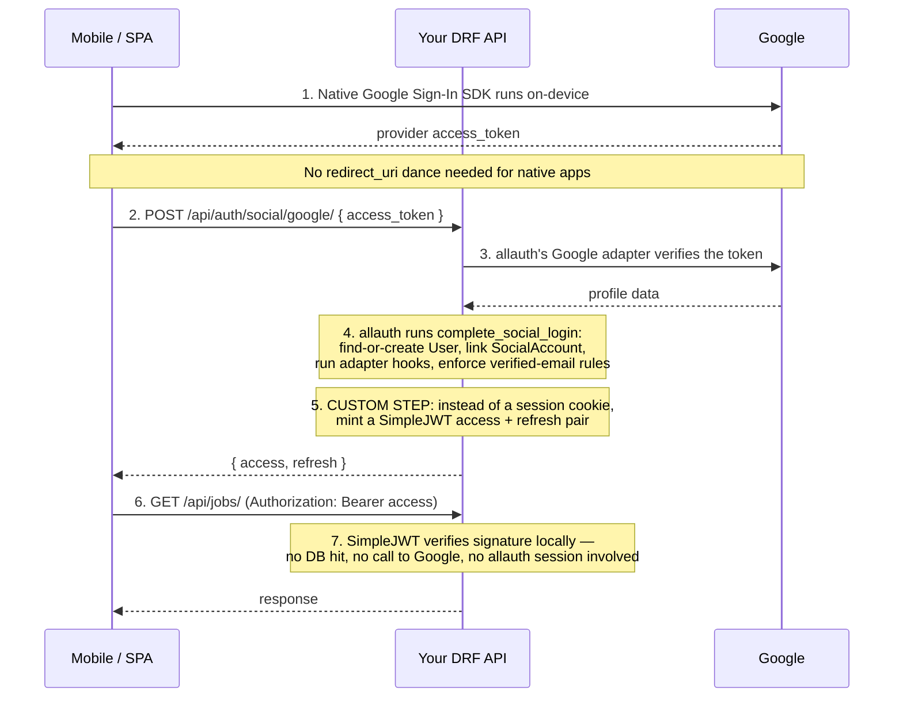

# OAuth for DRF — allauth + SimpleJWT (Custom Architecture)

> This guide covers a specific, deliberate architecture: **`django-allauth` does the OAuth dance with the provider** (Google/GitHub/Microsoft — verifying the user, running your account-linking logic, running your adapter hooks), but **you never hand the client an allauth session cookie or an allauth headless token**. Instead, a thin custom view exchanges a successful social login for your own `djangorestframework-simplejwt` access/refresh pair. You get allauth's battle-tested provider integrations and account-linking logic, plus full control over what's inside the token, how it's verified, and how it scales — without adopting allauth's session model or `django-oauth-toolkit`'s full authorization-server machinery. Current package versions as of mid-2026.

---

## Table of Contents

1. [Concepts — How the Pieces Fit Together](#concepts)
2. [Why Custom Instead of Allauth Sessions / Headless Tokens / DOT](#why-custom)
3. [Installation](#install)
4. [Settings Reference](#settings)
5. [Provider Configuration (Google, GitHub, Microsoft)](#providers)
6. [The Custom Glue — Exchanging a Social Login for a JWT Pair](#glue)
7. [URLs](#urls)
8. [DRF Authentication & Protecting Views](#auth)
9. [Custom Claims & Per-Object Scoping](#claims)
10. [Refresh, Rotation & Blacklisting](#refresh)
11. [Scaling to Production](#scaling)
12. [Security Checklist](#security)
13. [Testing](#testing)
14. [Common Errors & Fixes](#errors)
15. [Quick Reference](#reference)

---

## 1. Concepts — How the Pieces Fit Together {#concepts}



**Key vocabulary (delta from a standard OAuth-client guide):**

| Term | Meaning here |
|---|---|
| **allauth's role** | Provider verification + account linking only. It never issues the credential your API actually trusts. |
| **SimpleJWT's role** | Issues, verifies, and rotates the credential your API actually trusts. Knows nothing about Google/GitHub. |
| **The glue view** | Your code. Bridges the two: takes a provider token in, returns a JWT pair out. This is the part that isn't "just allauth" or "just SimpleJWT" — it's the custom architecture. |
| **`SocialLogin` object** | allauth's internal representation of "this User, linked to this SocialAccount, from this provider, with this token" — the thing `complete_social_login` operates on. You construct this by hand in the glue view rather than letting allauth's own views build it from a browser redirect. |
| **Access token (JWT)** | Short-lived, self-verifying. Contains claims (`user_id`, `exp`, plus whatever custom claims you add). |
| **Refresh token (JWT)** | Longer-lived, used to mint a new access token. Optionally rotated and blacklisted on use — SimpleJWT, not allauth, owns this lifecycle entirely. |

---

## 2. Why Custom Instead of Allauth Sessions / Headless Tokens / DOT {#why-custom}

| Option | What you get | Why you might *not* want it here |
|---|---|---|
| Plain allauth (session cookie) | Simplest, zero glue code | Cookies are awkward for native mobile clients and don't horizontally scale the same way as stateless tokens; CSRF and cross-subdomain cookie rules add friction for a pure API product |
| `allauth.headless` with `HEADLESS_TOKEN_STRATEGY` | A JSON API and token support out of the box | The token format and claim structure are allauth's to define; you're limited in adding custom claims, custom expiry logic per-plan, or a DRF-idiomatic `IsAuthenticated`/scope permission story |
| `django-oauth-toolkit` (full provider) | Spec-compliant OAuth2 authorization server, third-party client registration, consent screens | Overkill if the only "client" is your own mobile app/SPA — you don't need `/o/authorize/`, consent screens, or third-party `client_id` management for first-party clients |
| **This guide: allauth (verification) + SimpleJWT (tokens)** | allauth's proven provider adapters and account-linking logic, DRF-native token auth, full control of claims/expiry/rotation, no consent screen or client registry overhead | You own the glue view and its edge cases — this guide exists to hand you a correct one |

Use this architecture when: the token consumer is a client you control (your mobile app, your SPA) — not a third-party developer integrating with a public API of yours. If you later need to let external developers issue tokens against your API, that's Part B territory from a full OAuth-provider guide (`django-oauth-toolkit`), and it can run alongside this without conflict.

---

## 3. Installation {#install}

```bash
pip install django-allauth djangorestframework djangorestframework-simplejwt
```

**Version notes (checked July 2026):**

| Package | Current | Compatibility notes |
|---|---|---|
| `django-allauth` | 65.18.0 (May 2026) | Officially supports Django 4.2–6.0. That said, **Django 4.2 itself went EOL on April 30, 2026** — the classifier being present doesn't mean it's a version you should deploy on. Target **Django 5.2 LTS** (supported to April 2028) or **Django 6.0** for new projects. |
| `djangorestframework` | 3.17.1 (March 2026) | Official Django 6.0 support only landed in **3.17.0** — if your DRF pin predates that, upgrade before moving to Django 6.0. 3.17 also dropped Python 3.9 support. |
| `djangorestframework-simplejwt` | 5.5.1 | This is a maintenance-mode project — no new release in roughly 11 months as of this check. Its own docs list official support only through Django 5.2; **Django 6.0 isn't in its tested compatibility table yet**, though nothing in the library touches anything 6.0-specific and no community-reported issues have surfaced. Treat it as "works in practice, not yet officially certified," and test your own upgrade path before relying on it in production. |

Requires Python 3.10+ (3.12+ recommended — it's what Django 6.0 and current DRF are actually tested against).

```python
# settings.py
INSTALLED_APPS = [
    # ...
    "django.contrib.auth",
    "django.contrib.sites",          # required by allauth

    "rest_framework",
    "rest_framework_simplejwt",
    "rest_framework_simplejwt.token_blacklist",   # needed for refresh-token blacklisting

    "allauth",
    "allauth.account",
    "allauth.socialaccount",
    "allauth.socialaccount.providers.google",
    "allauth.socialaccount.providers.github",
    "allauth.socialaccount.providers.microsoft",
]

SITE_ID = 1

MIDDLEWARE = [
    # ...
    "django.contrib.sessions.middleware.SessionMiddleware",
    "django.contrib.auth.middleware.AuthenticationMiddleware",
    "allauth.account.middleware.AccountMiddleware",   # required by allauth 0.62+ even if you never use sessions for auth
]
```

```bash
python manage.py migrate
```

Note the session middleware stays installed even though your API auth is JWT — allauth's internal provider-verification flow (`complete_social_login`) still expects a `request` with session support available, even if you never rely on the session it sets for authentication.

---

## 4. Settings Reference {#settings}

```python
# ─────────────────────────────────────────────────────────────────
# DRF — JWT is the only auth your API trusts
# ─────────────────────────────────────────────────────────────────
REST_FRAMEWORK = {
    "DEFAULT_AUTHENTICATION_CLASSES": [
        "rest_framework_simplejwt.authentication.JWTAuthentication",
    ],
    "DEFAULT_PERMISSION_CLASSES": [
        "rest_framework.permissions.IsAuthenticated",
    ],
}

# ─────────────────────────────────────────────────────────────────
# SimpleJWT
# ─────────────────────────────────────────────────────────────────
from datetime import timedelta

SIMPLE_JWT = {
    "ACCESS_TOKEN_LIFETIME": timedelta(minutes=15),
    "REFRESH_TOKEN_LIFETIME": timedelta(days=30),

    # Issue a brand-new refresh token on every use, and blacklist the
    # one just used — a reused (stolen) refresh token becomes detectable.
    "ROTATE_REFRESH_TOKENS": True,
    "BLACKLIST_AFTER_ROTATION": True,
    "UPDATE_LAST_LOGIN": True,

    "ALGORITHM": "HS256",          # switch to RS256 before scaling past one verifying service — see §11
    "SIGNING_KEY": env("JWT_SIGNING_KEY", default=None),  # falls back to SECRET_KEY if unset; set explicitly in production
    "AUTH_HEADER_TYPES": ("Bearer",),
    "USER_ID_FIELD": "id",
    "USER_ID_CLAIM": "user_id",

    # Where custom claims get attached — see §9
    "TOKEN_OBTAIN_SERIALIZER": "api.auth.serializers.CustomTokenObtainPairSerializer",
}

# ─────────────────────────────────────────────────────────────────
# allauth — provider verification only, no email/password UI needed
# if social login is your only path in
# ─────────────────────────────────────────────────────────────────
SOCIALACCOUNT_AUTO_SIGNUP = True
SOCIALACCOUNT_EMAIL_AUTHENTICATION = True
SOCIALACCOUNT_EMAIL_AUTHENTICATION_AUTO_CONNECT = True   # only ever auto-links on a PROVIDER-VERIFIED email
SOCIALACCOUNT_STORE_TOKENS = True    # keep provider tokens if you'll call Google/GitHub APIs later on the user's behalf

ACCOUNT_ADAPTER = "api.auth.adapters.AccountAdapter"
SOCIALACCOUNT_ADAPTER = "api.auth.adapters.SocialAccountAdapter"

# ─────────────────────────────────────────────────────────────────
# Security
# ─────────────────────────────────────────────────────────────────
SESSION_COOKIE_SECURE = True
CSRF_COOKIE_SECURE = True
```

---

## 5. Provider Configuration (Google, GitHub, Microsoft) {#providers}

Same provider registration as a standard allauth setup — allauth still owns "is this token really from Google, and what does Google say about this user." You're only replacing what happens *after* that verification succeeds.

```python
SOCIALACCOUNT_PROVIDERS = {
    "google": {
        "SCOPE": ["profile", "email"],
        "APP": {
            "client_id": env("GOOGLE_OAUTH_CLIENT_ID"),
            "secret": env("GOOGLE_OAUTH_CLIENT_SECRET"),
        },
    },
    "github": {
        "SCOPE": ["user:email"],
        "APP": {
            "client_id": env("GITHUB_OAUTH_CLIENT_ID"),
            "secret": env("GITHUB_OAUTH_CLIENT_SECRET"),
        },
    },
    "microsoft": {
        "APP": {
            "client_id": env("MICROSOFT_OAUTH_CLIENT_ID"),
            "secret": env("MICROSOFT_OAUTH_CLIENT_SECRET"),
        },
        "TENANT": env("MICROSOFT_TENANT_ID", default="common"),
    },
}
```

For native mobile clients, the redirect-based `redirect_uri` registered in each provider console matters less than for a browser flow — most native SDKs (Google Sign-In, GitHub's device flow, MSAL) hand the app a provider access token directly, on-device, which is what your glue view (§6) receives. If you *do* support a browser/PKCE code-exchange path too (e.g. a web SPA), register the standard `https://yourdomain.com/accounts/<provider>/login/callback/` redirect URI as usual — the code-exchange step still ends at the same glue view, just fed by a `code` instead of a raw `access_token`.

**Never commit client secrets** — load from environment variables or a secrets manager.

---

## 6. The Custom Glue — Exchanging a Social Login for a JWT Pair {#glue}

This is the core of the architecture. The view below:

1. Takes a provider access token from the client (already obtained on-device via the provider's native SDK).
2. Hands it to allauth's provider adapter to verify it against the provider and fetch profile data — reusing allauth's tested verification logic rather than hand-rolling a Google token-verification call.
3. Runs it through `complete_social_login`, which finds-or-creates the `User`, links the `SocialAccount`, and runs your adapter hooks (`populate_user`, `pre_social_login`) exactly as it would in a browser flow.
4. Instead of letting that call finish by setting a session cookie and redirecting, mints a SimpleJWT pair for the resulting user and returns it as JSON.

```python
# api/auth/adapters.py
from allauth.socialaccount.adapter import DefaultSocialAccountAdapter


class SocialAccountAdapter(DefaultSocialAccountAdapter):
    def populate_user(self, request, sociallogin, data):
        user = super().populate_user(request, sociallogin, data)
        if sociallogin.account.provider == "google":
            user.avatar_url = data.get("picture", "")
        return user

    def pre_social_login(self, request, sociallogin):
        # Runs whether the login came from a browser redirect or, as here,
        # from the glue view below — your linking/fraud/invite-only logic
        # only needs to live in one place.
        pass
```

```python
# api/auth/views.py
from allauth.socialaccount.providers.google.views import GoogleOAuth2Adapter
from allauth.socialaccount.providers.github.views import GitHubOAuth2Adapter
from allauth.socialaccount.models import SocialToken, SocialApp
from allauth.socialaccount.helpers import complete_social_login
from allauth.core.exceptions import ImmediateHttpResponse
from rest_framework.views import APIView
from rest_framework.response import Response
from rest_framework import status
from rest_framework_simplejwt.tokens import RefreshToken

PROVIDER_ADAPTERS = {
    "google": GoogleOAuth2Adapter,
    "github": GitHubOAuth2Adapter,
}


class SocialLoginJWTView(APIView):
    """
    POST /api/auth/social/<provider>/
    Body: { "access_token": "<raw token from the provider's native SDK>" }
    Returns: { "access": "...", "refresh": "..." }
    """
    permission_classes = []
    authentication_classes = []

    def post(self, request, provider):
        adapter_cls = PROVIDER_ADAPTERS.get(provider)
        if adapter_cls is None:
            return Response({"detail": "Unknown provider."}, status=status.HTTP_400_BAD_REQUEST)

        raw_token = request.data.get("access_token")
        if not raw_token:
            return Response({"detail": "access_token is required."}, status=status.HTTP_400_BAD_REQUEST)

        adapter = adapter_cls(request)
        app = SocialApp.objects.get_current(provider, request)
        token = SocialToken(app=app, token=raw_token)

        try:
            # This is the part that actually talks to Google/GitHub to
            # verify the token and fetch profile data.
            login = adapter.complete_login(request, app, token, response=request.data)
        except Exception:
            return Response({"detail": "Invalid or expired provider token."}, status=status.HTTP_401_UNAUTHORIZED)

        login.token = token
        login.state = {}

        try:
            # Runs find-or-create User, verified-email account linking,
            # and your adapter hooks. Raises ImmediateHttpResponse if your
            # adapter denies the login (e.g. invite-only, banned user).
            complete_social_login(request, login)
        except ImmediateHttpResponse:
            return Response({"detail": "Login not permitted."}, status=status.HTTP_403_FORBIDDEN)

        user = login.account.user
        if not user.is_active:
            return Response({"detail": "Account disabled."}, status=status.HTTP_403_FORBIDDEN)

        refresh = RefreshToken.for_user(user)
        return Response({
            "access": str(refresh.access_token),
            "refresh": str(refresh),
        })
```

**Notes on this view:**

- `complete_social_login` internally calls Django's `login()` and will set a session cookie as a side effect. That's harmless — nothing in this architecture reads it — but if you want a purely stateless API with zero session writes, call the lower-level pieces (`sociallogin.save(request, connect=...)` plus your own account-linking check) instead of `complete_social_login`, at the cost of re-implementing the parts of it you still want (verified-email auto-connect, adapter hook ordering).
- `SocialApp.objects.get_current(provider, request)` requires the `SocialApp` row for that provider/site to exist (Admin, or from `SOCIALACCOUNT_PROVIDERS[...]["APP"]` via `allauth.socialaccount.models.SocialApp.objects.get_current` fallback — confirm your allauth version's fallback behavior, since this varies across releases).
- For a **web SPA using the authorization-code + PKCE flow** instead of a native SDK, swap step 2: exchange the `code` for a provider token server-side first (`adapter.complete_login` with an `OAuth2Client`, matching allauth's own callback view internals), then continue at step 3 unchanged.

---

## 7. URLs {#urls}

```python
# urls.py
from django.urls import path
from api.auth.views import SocialLoginJWTView
from rest_framework_simplejwt.views import TokenRefreshView, TokenBlacklistView

urlpatterns = [
    path("api/auth/social/<str:provider>/", SocialLoginJWTView.as_view(), name="social-login-jwt"),
    path("api/auth/token/refresh/", TokenRefreshView.as_view(), name="token-refresh"),
    path("api/auth/token/blacklist/", TokenBlacklistView.as_view(), name="token-blacklist"),  # logout
]
```

Deliberately, there's no `include("allauth.urls")` and no `include("allauth.headless.urls")` here — allauth is used purely as a library (its adapters, its models, `complete_social_login`) from inside your own view, not as a set of routes your client talks to directly.

---

## 8. DRF Authentication & Protecting Views {#auth}

Default DRF views just work once `DEFAULT_AUTHENTICATION_CLASSES` is set (§4):

```python
from rest_framework.views import APIView
from rest_framework.response import Response
from rest_framework.permissions import IsAuthenticated


class MeView(APIView):
    permission_classes = [IsAuthenticated]

    def get(self, request):
        return Response({"id": request.user.id, "email": request.user.email})
```

`request.user` is a real Django `User` instance — SimpleJWT's `JWTAuthentication` resolves the `user_id` claim against the DB on every request by default (one indexed PK lookup, not a full session lookup), so `request.user.is_staff`, permission classes, and ORM relations all behave normally.

---

## 9. Custom Claims & Per-Object Scoping {#claims}

### Adding custom claims to the token

```python
# api/auth/serializers.py
from rest_framework_simplejwt.serializers import TokenObtainPairSerializer


class CustomTokenObtainPairSerializer(TokenObtainPairSerializer):
    @classmethod
    def get_token(cls, user):
        token = super().get_token(user)
        token["role"] = getattr(user, "role", "member")
        token["plan"] = user.organization.plan if hasattr(user, "organization") else None
        return token
```

This serializer is only exercised by SimpleJWT's own `TokenObtainPairView` (username/password login). Since your entry point is the social glue view in §6, add claims there instead, using the same `get_token` classmethod so both paths stay consistent:

```python
from api.auth.serializers import CustomTokenObtainPairSerializer

refresh = CustomTokenObtainPairSerializer.get_token(user)
access = refresh.access_token
```

### Enforcing scope/role claims per view

```python
# api/auth/permissions.py
from rest_framework.permissions import BasePermission


class HasRole(BasePermission):
    required_role = None

    def has_permission(self, request, view):
        token = getattr(request, "auth", None)
        return bool(token) and token.get("role") == self.required_role


class IsAdminRole(HasRole):
    required_role = "admin"
```

### Per-object scoping (a token for User A should never return User B's data)

Same principle as any token-based API: the claim answers "can this token touch this endpoint," never "can this token touch this specific row." That check belongs in the view:

```python
from rest_framework.generics import RetrieveAPIView
from rest_framework.exceptions import PermissionDenied


class JobDetailView(RetrieveAPIView):
    queryset = Job.objects.all()

    def get_object(self):
        job = super().get_object()
        if job.employer_id != self.request.user.id:
            raise PermissionDenied("This token cannot access this job.")
        return job
```

---

## 10. Refresh, Rotation & Blacklisting {#refresh}

```bash
python manage.py migrate token_blacklist
```

```bash
# Client refreshes an expiring access token
curl -X POST https://yourdomain.com/api/auth/token/refresh/ \
  -d "refresh=<refresh_token>"
# → { "access": "...", "refresh": "..." }   # new refresh issued because ROTATE_REFRESH_TOKENS=True

# Logout — blacklist the refresh token so it can never be used again
curl -X POST https://yourdomain.com/api/auth/token/blacklist/ \
  -d "refresh=<refresh_token>"
```

With `ROTATE_REFRESH_TOKENS` + `BLACKLIST_AFTER_ROTATION` both on, a refresh token that gets used twice (the legitimate client and an attacker who stole it, racing each other) is detectable: the second use fails because the first use already blacklisted it. Treat that as a signal to force-logout the account (revoke all outstanding tokens for that user) if you see it in logs.

Run `python manage.py flushexpiredtokens` on a schedule (Celery Beat, cron) — like DOT's `cleartokens`, the blacklist table otherwise grows forever.

---

## 11. Scaling to Production {#scaling}

- **Move off `HS256` before you have more than one service verifying tokens.** `HS256` signs with a single shared secret — anything that verifies a token also needs the ability to *forge* one, which is fine for a single Django process but wrong the moment a separate microservice needs to check tokens independently. Switch to `RS256`:

  ```python
  SIMPLE_JWT = {
      "ALGORITHM": "RS256",
      "SIGNING_KEY": env("JWT_RSA_PRIVATE_KEY"),     # only your auth service holds this
      "VERIFYING_KEY": env("JWT_RSA_PUBLIC_KEY"),    # any service can hold this and verify locally
  }
  ```
  This is the same lever a full OIDC/JWT provider setup relies on — once it's RS256, verification is a local signature check, not a database or network round-trip, and that's what actually lets the API scale horizontally.

- **`complete_social_login`'s session write is a no-op for your API, but it's still a session table write.** If you're not using sessions for anything else, consider swapping `django.contrib.sessions.backends.db` for a cache-backed session engine so this incidental write doesn't add DB load at high signup/login QPS.

- **`JWTAuthentication` hits the DB once per request** (resolving `user_id` → `User`). At high QPS, make sure that query is served by a read replica or a cache (`select_related` any commonly-accessed related objects your permission classes touch, e.g. `user.organization`).

- **Rate-limit `/api/auth/social/<provider>/` and `/api/auth/token/refresh/` at the edge** — these are exactly the endpoints credential-stuffing and refresh-token-grinding attacks target.

- **Cache provider verification calls where the provider allows it** — `adapter.complete_login` makes a live network call to Google/GitHub on every social login; that's inherent to the security model (you can't skip verifying the token), but keep an eye on it as a latency and third-party-dependency risk at scale, and add a timeout + circuit breaker around it.

---

## 12. Security Checklist {#security}

- [ ] `access_token` from the client is always verified against the provider inside `adapter.complete_login` — never trust a client-supplied profile payload without this step
- [ ] `SIMPLE_JWT["SIGNING_KEY"]` (or RSA private key) is in a secrets manager, never version control, and is distinct from `SECRET_KEY` in production
- [ ] `ROTATE_REFRESH_TOKENS` and `BLACKLIST_AFTER_ROTATION` are both `True`
- [ ] Access token lifetime is short (minutes); refresh lifetime is the only long-lived credential
- [ ] `SOCIALACCOUNT_EMAIL_AUTHENTICATION_AUTO_CONNECT` only ever links accounts on a provider-verified email — never on an unverified one
- [ ] `complete_social_login` failures (`ImmediateHttpResponse`, adapter exceptions) return a generic 401/403 — don't leak whether an email/account exists
- [ ] Blacklist/logout endpoint is reachable and actually called by clients on sign-out — a stolen refresh token otherwise stays valid for its full lifetime
- [ ] Rate limiting is on for the social-login and refresh endpoints
- [ ] If storing provider `SocialToken`s (`SOCIALACCOUNT_STORE_TOKENS`), treat them as sensitive — encrypt at rest if compliance requires it
- [ ] Dependencies pinned and updated on a schedule — both `django-allauth` and `djangorestframework-simplejwt` have shipped real CVE fixes

---

## 13. Testing {#testing}

```python
from unittest.mock import patch
from django.test import TestCase
from rest_framework.test import APIClient
from django.contrib.auth import get_user_model


class SocialLoginJWTTest(TestCase):
    def setUp(self):
        self.client = APIClient()

    @patch("api.auth.views.GoogleOAuth2Adapter.complete_login")
    def test_new_user_gets_jwt_pair(self, mock_complete_login):
        # Build a fake allauth SocialLogin the way adapter.complete_login would,
        # so complete_social_login runs your real adapter hooks in the test.
        from allauth.socialaccount.models import SocialLogin, SocialAccount
        User = get_user_model()
        user = User(email="new@example.com")
        account = SocialAccount(provider="google", uid="12345", user=user)
        mock_complete_login.return_value = SocialLogin(user=user, account=account)

        response = self.client.post(
            "/api/auth/social/google/", {"access_token": "fake-token"}, format="json"
        )
        self.assertEqual(response.status_code, 200)
        self.assertIn("access", response.data)
        self.assertIn("refresh", response.data)

    def test_missing_token_rejected(self):
        response = self.client.post("/api/auth/social/google/", {}, format="json")
        self.assertEqual(response.status_code, 400)


class ProtectedEndpointTest(TestCase):
    def setUp(self):
        User = get_user_model()
        self.user = User.objects.create_user(username="alice", email="alice@example.com")
        self.client = APIClient()

    def test_authenticated_with_jwt(self):
        from rest_framework_simplejwt.tokens import RefreshToken
        access = str(RefreshToken.for_user(self.user).access_token)
        self.client.credentials(HTTP_AUTHORIZATION=f"Bearer {access}")
        response = self.client.get("/api/me/")
        self.assertEqual(response.status_code, 200)

    def test_missing_token_rejected(self):
        response = self.client.get("/api/me/")
        self.assertEqual(response.status_code, 401)
```

---

## 14. Common Errors & Fixes {#errors}

| Error | Root Cause | Fix |
|---|---|---|
| `SocialApp matching query does not exist` | No `SocialApp` row for that provider/site | Create in Admin, or ensure `SOCIALACCOUNT_PROVIDERS[...]["APP"]` is set and `SITE_ID` matches |
| Provider `complete_login` raises / 401 from your glue view | The client sent an expired or wrong-audience provider token, or your provider console's OAuth client ID doesn't match the one the mobile SDK used | Confirm the mobile SDK's configured client ID matches the one in `SOCIALACCOUNT_PROVIDERS`; check token expiry on the client side |
| User created twice for the same email (one direct, one social) | Provider didn't mark the email verified, or `SOCIALACCOUNT_EMAIL_AUTHENTICATION_AUTO_CONNECT` is off | Enable it; only auto-link on a provider-verified email, by design |
| `AttributeError: 'NoneType' object has no attribute 'access_token'` in the glue view | `RefreshToken.for_user(user)` called before `user` is saved (e.g. adapter hook raised silently) | Check `complete_social_login` actually returned/committed a saved `User` before minting tokens |
| `Token is blacklisted` on refresh | Refresh token was already rotated-and-blacklisted by a prior use (possibly attacker or client double-submit) | Expected behavior — force a fresh login; investigate if this happens for a legitimate client under normal use (usually a race in retry logic) |
| 401 on every protected view despite a fresh token | `DEFAULT_AUTHENTICATION_CLASSES` not set, or `AUTH_HEADER_TYPES` mismatch with what the client sends | Confirm `Authorization: Bearer <token>` matches `SIMPLE_JWT["AUTH_HEADER_TYPES"]` |
| `ImmediateHttpResponse` swallowed as a generic 500 | Adapter's `pre_social_login`/`is_open_for_signup` raised it, but the glue view didn't catch `allauth.core.exceptions.ImmediateHttpResponse` | Wrap `complete_social_login` in a `try/except ImmediateHttpResponse` as shown in §6 |
| `token_blacklist` app errors on migrate | App added to `INSTALLED_APPS` but migrations not run | `python manage.py migrate token_blacklist` |

---

## 15. Quick Reference {#reference}

```bash
pip install django-allauth djangorestframework djangorestframework-simplejwt
python manage.py migrate
```

```python
# urls.py
urlpatterns = [
    path("api/auth/social/<str:provider>/", SocialLoginJWTView.as_view()),
    path("api/auth/token/refresh/", TokenRefreshView.as_view()),
    path("api/auth/token/blacklist/", TokenBlacklistView.as_view()),
]
```

```python
# Core settings to always set explicitly
REST_FRAMEWORK = {
    "DEFAULT_AUTHENTICATION_CLASSES": ["rest_framework_simplejwt.authentication.JWTAuthentication"],
}
SIMPLE_JWT = {
    "ROTATE_REFRESH_TOKENS": True,
    "BLACKLIST_AFTER_ROTATION": True,
    "ALGORITHM": "RS256",   # once you have more than one verifying service
}
SOCIALACCOUNT_EMAIL_AUTHENTICATION_AUTO_CONNECT = True
```

```python
# The whole architecture in one line:
# allauth verifies WHO the user is (via the provider) →
# your glue view decides WHAT credential to hand back (a SimpleJWT pair) →
# SimpleJWT owns everything about that credential from then on.
```
