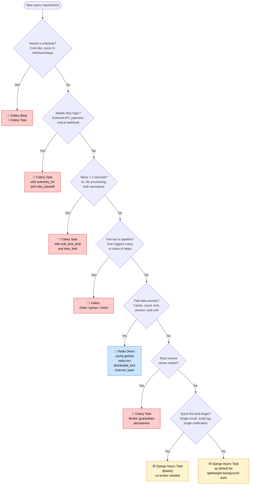

# Async Use Cases — Celery vs Redis vs Django Tasks — Definitive Guide

> This guide answers one question exhaustively: for any given async requirement, which tool do you reach for and exactly why? It covers the decision rule, detailed comparison, every real-world use case categorized, full end-to-end flow examples, anti-patterns, and a colored decision flowchart.

---

## Table of Contents

1. [The Core Decision Rule](#decision-rule)
2. [Tool Comparison](#comparison)
3. [When to Use Each Tool](#when-to-use)
4. [Real-World Use Case Map](#use-case-map)
5. [End-to-End Flow Examples](#flow-examples)
6. [Anti-Patterns — What Not to Do](#anti-patterns)
7. [Decision Flowchart](#flowchart)
8. [Summary Table](#summary)

---

## 1. The Core Decision Rule {#decision-rule}

Apply these questions in order. Stop at the first match.

```
1. Does this need to run on a schedule (cron-like, every N minutes/hours/days)?
   → YES → Celery Beat + Celery Task

2. Does this need retry logic if it fails (external APIs, payment processing, webhooks)?
   → YES → Celery Task

3. Does this take more than 2 seconds to complete?
   → YES → Celery Task

4. Is this a chain or fan-out of sub-tasks (one triggers many, or many before one)?
   → YES → Celery Task (chain / group / chord)

5. Is this about fast data access — caching a query result, counting, locking, sessions?
   → YES → Redis directly (no task queue needed)

6. Is this a quick fire-and-forget directly triggered by a user action (< 2 seconds)?
   → YES → Django Async Task

7. Is this critical and must not be lost if the server restarts?
   → YES → Celery Task (broker persists it)

8. None of the above?
   → Django Async Task as default for lightweight background work
```

---

## 2. Tool Comparison {#comparison}

### Full Feature Matrix

| Feature | Celery Task | Django Async Task | Redis Direct |
|---|---|---|---|
| **Needs a message broker (Redis)** | Yes — required | No | N/A — Redis IS the tool |
| **Needs a separate worker process** | Yes — `celery worker` | Yes — `db_worker` (lightweight) | No |
| **Task survives server/worker restart** | Yes — stored in broker | Yes — stored in Django DB | Yes — if AOF persistence enabled |
| **Built-in retry logic** | Yes — `max_retries`, `retry_backoff` | No — must handle manually | No |
| **Scheduled / periodic execution** | Yes — Celery Beat | No | No |
| **Task state tracking** | Yes — PENDING, STARTED, SUCCESS, FAILURE, RETRY | Yes — NEW, RUNNING, COMPLETE, FAILED | No |
| **Task chaining (output feeds next)** | Yes — `chain()` | No | No |
| **Fan-out (parallel sub-tasks)** | Yes — `group()`, `chord()` | No | No |
| **Monitoring UI** | Yes — Flower | Admin only | Redis CLI + external tools |
| **Rate limiting per task type** | Yes — `rate_limit` option | No | Yes — `INCR + EXPIRE` |
| **Priority queues** | Yes — multiple queues | Limited | No |
| **Setup complexity** | High — broker + workers + beat + monitoring | Low — no broker needed | Medium — just the Redis client |
| **Infrastructure overhead** | High — Redis + Celery workers + Beat process | Low — uses Django DB | Low — Redis only |
| **Best for** | Heavy, critical, long, scheduled, chained tasks | Lightweight fire-and-forget | Data storage, counters, locks, sessions |

---

## 3. When to Use Each Tool {#when-to-use}

### 🔴 Always Celery — No Exceptions

Use Celery when any of these conditions are true:

**The task is long-running.** If a task takes more than 2 seconds, it blocks a web worker thread from handling other requests. Anything AI-related, file processing, external API calls, or report generation belongs in Celery.

**The task must not be lost.** Celery stores the task in the Redis broker the moment `.delay()` is called. Even if every worker dies immediately after, the task persists in Redis and will be picked up when workers restart. Django Async Tasks are stored in the Django DB, but if the DB write fails, the task is lost. Redis broker is specifically optimized for message durability.

**The task needs retry logic.** External APIs fail. SMTP servers time out. Payment processors return transient errors. Any task that calls an external service should have retry logic with exponential backoff. Celery has this built in. Django Tasks do not.

**The task runs on a schedule.** Daily expiry checks, weekly digest emails, hourly score recalculations — these belong to Celery Beat.

**The task triggers a pipeline.** Resume upload → parse → score → notify employer is a three-step chain. Use Celery `chain()`.

**The task fans out to many sub-tasks.** Sending a bulk email campaign to 10,000 users is one Celery task per user, coordinated with `group()` or `chord()`.

---

### 🟡 Django Async Tasks — Lightweight Fire-and-Forget

Use Django Tasks when all of these conditions are true:

**The task is triggered by a single user action.** Registration sends a welcome email. Password reset sends a reset link. Application submission confirms receipt.

**The task takes less than 2 seconds.** Sending a single email via an SMTP relay takes ~50–200ms. Writing an audit log row takes ~5ms. These are fast.

**No retry logic is needed.** If the welcome email fails, the user can request a resend. If the audit log write fails, logging an error is sufficient. The business doesn't stop.

**No schedule is needed.** This is reactive, not proactive.

**Infrastructure simplicity matters.** Early-stage projects or small teams may not want the overhead of a Celery worker + Beat + monitoring just to send a welcome email. Django Tasks give you background processing with nothing more than `python manage.py db_worker`.

---

### 🔵 Redis Direct — Data, Not Tasks

Use Redis directly when you're not queuing a task — you're reading or writing fast data.

**Caching.** The result of a slow DB query, a computed aggregate, or a frequently requested resource belongs in Redis with a TTL. No task queue needed.

**Sessions.** User session data needs to be fast and shared across all web workers. Redis is the right store.

**Rate limiting.** Atomic `INCR` with `EXPIRE` gives you a per-user or per-IP counter that resets after a time window. No task needed.

**Distributed locks.** Preventing two workers from processing the same payout simultaneously requires an atomic set-if-not-exists. That's a Redis primitive.

**Real-time pub/sub.** Pushing a notification to a connected WebSocket client uses the Django Channels layer, which is backed by Redis.

**Counters and analytics.** Total views on a job posting, unique visitors, leaderboard scores — these are atomic Redis operations, not DB writes.

---

## 4. Real-World Use Case Map {#use-case-map}

### Categorized by Tool

#### 🔴 Celery Tasks

| Use Case | Why Celery | Queue |
|---|---|---|
| AI resume parsing | 10–60 seconds; needs retry on AI service failure | `ai_tasks` |
| AI job-seeker matching score calculation | CPU-heavy; can be batched | `ai_tasks` |
| Bulk email campaign (1000+ recipients) | Fan-out to many sub-tasks; rate limiting per SMTP relay | `emails` |
| PDF report generation | CPU-heavy; can take 30–120 seconds | `low_priority` |
| Excel export for employer | File processing; blocking for large datasets | `low_priority` |
| Payment processing | Critical; must not be lost; needs retry with backoff | `high_priority` |
| Outbound webhook delivery | External HTTP; must retry on failure | `default` |
| Employer notification (fan-out) | One application → notify employer via email + push + in-app | `notifications` |
| Job posting expiry check (nightly) | Scheduled; Celery Beat | `low_priority` |
| Daily digest email | Scheduled; Celery Beat | `emails` |
| Recommendation score refresh (every 30 min) | Scheduled; Celery Beat | `ai_tasks` |
| Cascading delete cleanup | Background DB cleanup; can be slow | `low_priority` |
| Resume file virus scan | External service call; needs retry | `default` |
| Video/image processing | Long-running; FFmpeg or image resize | `default` |

#### 🟡 Django Async Tasks

| Use Case | Why Django Task |
|---|---|
| Send welcome email after registration | Single email; fast; no retry needed |
| Send password reset link | Single email; fast; no retry needed |
| Send application confirmation email | Single email; fast |
| Write audit log entry | Fast DB insert; non-critical |
| Send single in-app notification | Fast DB insert; no retry needed |
| Update denormalized job application count | Fast DB update; acceptable to lose on restart |
| Enqueue a Celery chain (decoupled trigger) | Django task reads context and dispatches Celery chain |
| Log a search query for analytics | Fast DB insert; non-critical |

#### 🔵 Redis Direct

| Use Case | How |
|---|---|
| Cache job listing query (page 1, sorted by recent) | `cache.get_or_set("jobs:list:page:1:sort:recent", ...)` |
| Cache employer's active job count | `cache.set(f"employer:{id}:active_jobs_count", n, 120)` |
| Cache job detail page | `cache.set(f"job:{id}:detail", data, 600)` |
| Rate limit job applications (max 10/hour per user) | `redis.incr + redis.expire` |
| Rate limit API requests per IP | `redis.incr + redis.expire` |
| Store user session data | `SESSION_ENGINE = cache` |
| Distributed lock on payout processing | `redis.set(nx=True, ex=30)` |
| Unique job view counter (approximate) | `redis.pfadd + redis.pfcount` (HyperLogLog) |
| Job view count (exact, per-day) | `redis.incr(f"views:job:{id}:{date}")` |
| Recent search history (last 10 searches) | `redis.lpush + redis.ltrim` |
| Employer leaderboard by applications received | `redis.zadd + redis.zincrby + redis.zrevrange` |
| Push notification to WebSocket client | Channels layer: `channel_layer.group_send` |
| Feature flag check | `cache.get("feature:new_ui:enabled")` |
| Cache AI model inference result | `cache.set(f"ai:score:resume:{id}", score, 3600)` |

---

## 5. End-to-End Flow Examples {#flow-examples}

### Flow A: User Registration

```
User submits registration form (POST /api/v1/auth/register/)
│
├── Django view (SYNC — request thread)
│   ├── Validate form inputs
│   ├── Create User record
│   ├── Create UserProfile record
│   └── transaction.on_commit() →
│       ├── Django Task: send_welcome_email(user_id)
│       │   └── Sends transactional email via SMTP relay (< 200ms)
│       └── Redis: cache.set(f"user:{user.id}:profile", {...}, timeout=300)
│
└── Return 201 Created response (fast — DB write only, no blocking)
```

**Why not Celery for the welcome email?** It's a single transactional email. It's fast. If it fails, the user notices and can trigger a resend. The overhead of a Celery broker is not justified.

---

### Flow B: Resume Uploaded

```
Seeker uploads resume PDF (POST /api/v1/resumes/)
│
├── Django view (SYNC)
│   ├── Validate file (type, size)
│   ├── Save file to object storage (S3/GCS)
│   ├── Create Resume record (status=PENDING)
│   └── transaction.on_commit() →
│       └── Celery Task: parse_and_score_resume.delay(resume_id=42)
│           └── Queue: ai_tasks
│
├── Return 202 Accepted (file is saved, parsing is in progress)
│
└── Celery Worker (AI queue, separate process)
    ├── parse_and_score_resume(resume_id=42)
    ├── Set Resume.status = PROCESSING
    ├── Call AI parsing service (10–60 seconds)
    │   └── On timeout or failure: retry up to 3 times with exponential backoff
    ├── Store parsed_data in Resume record
    ├── Calculate match score
    ├── Set Resume.status = COMPLETE
    ├── Redis: cache.delete(f"seeker:{seeker_id}:resumes")  ← invalidate list cache
    └── Celery Task: notify_seeker_resume_ready.delay(resume_id=42)
        └── Queue: notifications
            ├── Django Channels: push WebSocket notification to seeker
            └── Send push notification via FCM

Frontend polls GET /api/v1/resumes/42/ every 3 seconds to check status.
Or: WebSocket sends status update immediately when COMPLETE.
```

**Why Celery here?** 10–60 second AI call. Needs retry on AI service failure. Results feed into a notification chain. This is exactly what Celery is for.

---

### Flow C: Job Application Submitted

```
Seeker submits application (POST /api/v1/applications/)
│
├── Django view (SYNC)
│   ├── Validate inputs (seeker eligible, job active, no duplicate)
│   ├── Create Application record (status=PENDING)
│   └── transaction.on_commit() →
│       ├── Django Task: send_application_confirmation(application_id)
│       │   └── Email to seeker confirming application received
│       │
│       └── Celery Task: notify_employer_new_application.delay(application_id)
│           └── Queue: notifications
│               ├── In-app notification record created
│               ├── Push notification via FCM (if employer has app)
│               └── Email to employer (if employer has email notifications on)
│
├── Redis: cache.incr(f"job:{job_id}:application_count")
├── Redis: cache.delete(f"applications:job:{job_id}:list")  ← invalidate
└── Return 201 Created
```

---

### Flow D: Nightly Job Expiry Check (Periodic)

```
Celery Beat: every day at midnight UTC
│
└── Celery Task: expire_old_job_postings()
    ├── Queue: low_priority
    │
    ├── Query: Jobs WHERE deadline < now() AND status = 'ACTIVE'
    ├── Bulk update: status = 'EXPIRED'
    │
    ├── For each expired job → Celery group (parallel):
    │   └── notify_employer_job_expired.s(job_id)
    │       ├── Email to employer
    │       └── In-app notification
    │
    ├── Redis: cache.delete_pattern("jobs:list:*")
    ├── Redis: cache.delete_pattern("jobs:featured:*")
    └── Log: "Expired {count} jobs"
```

---

### Flow E: Employer Views Applicant List (Cache-First)

```
Employer requests GET /api/v1/jobs/42/applications/?page=1
│
├── Django view (SYNC)
│   ├── Authenticate + authorize (must be job owner)
│   └── cache_key = f"applications:job:42:page:1:employer:{employer_id}"
│       │
│       ├── Redis: cache.get(cache_key)
│       │   ├── HIT → return cached response immediately (< 1ms)
│       │   └── MISS →
│       │       ├── DB query (with select_related, paginated)
│       │       └── Redis: cache.set(cache_key, data, timeout=120)
│       │
│       └── Return 200 OK
```

**Note on TTL:** 120 seconds is short enough that a new application appears in the list quickly, but long enough to absorb repeated refreshes from the employer dashboard.

---

### Flow F: Real-Time Notification to Mobile App

```
Application status changes to INTERVIEW_SCHEDULED
│
├── Django signal: post_save on Application
│
└── transaction.on_commit() →
    └── Celery Task: send_status_change_notification.delay(application_id, new_status)
        │   Queue: notifications
        │
        ├── 1. Create Notification record in DB (for in-app notification center)
        │
        ├── 2. Redis Channels: push to WebSocket group "user_{seeker_id}"
        │   └── (web client receives it instantly if online)
        │
        ├── 3. FCM push notification (if seeker has mobile app installed)
        │   └── retry up to 3 times on FCM failure
        │
        └── 4. Email (if seeker has email notifications enabled in preferences)
            └── Queue: emails (separate worker)
```

---

## 6. Anti-Patterns — What Not to Do {#anti-patterns}

### ❌ Anti-Pattern 1: Dispatching Tasks Without `transaction.on_commit()`

```python
# WRONG
def create_application(user, job):
    app = Application.objects.create(user=user, job=job)
    notify_employer.delay(app.id)
    # Race condition: task may execute before the DB transaction commits.
    # Worker calls Application.objects.get(id=app.id) → DoesNotExist

# CORRECT
def create_application(user, job):
    app = Application.objects.create(user=user, job=job)
    transaction.on_commit(lambda: notify_employer.delay(app.id))
```

**When this matters:** Django wraps each request in a transaction by default (`ATOMIC_REQUESTS = True`). The transaction doesn't commit until the response is sent. If your task fires before the commit, the record isn't in the DB yet.

---

### ❌ Anti-Pattern 2: Importing Models at Module Level in Tasks

```python
# WRONG
from apps.accounts.models import User   # module-level

@shared_task
def send_email(user_id):
    user = User.objects.get(id=user_id)  # User was imported before Django was ready

# CORRECT
@shared_task
def send_email(user_id):
    from apps.accounts.models import User   # imported when task runs — Django is ready
    user = User.objects.get(id=user_id)
```

---

### ❌ Anti-Pattern 3: Passing Model Instances to Tasks

```python
# WRONG
send_email.delay(user=user_instance)
# TypeError: Object of type User is not JSON serializable

# CORRECT
send_email.delay(user_id=user.id)
# Worker fetches fresh data from DB inside the task
```

---

### ❌ Anti-Pattern 4: Using Celery for Fast, Simple Tasks

```python
# OVER-ENGINEERED — Celery is overkill for a 50ms DB write
@shared_task
def write_audit_log(user_id, action):
    AuditLog.objects.create(user_id=user_id, action=action)

# BETTER — Django Task is sufficient
@task()
def write_audit_log(user_id, action):
    AuditLog.objects.create(user_id=user_id, action=action)
```

Using Celery for every background task increases broker load, worker queue depth, and monitoring noise. Reserve Celery for tasks that actually need it.

---

### ❌ Anti-Pattern 5: Using Django Tasks for Critical Operations

```python
# WRONG — Django Task doesn't have retry logic
@task()
def process_payment(payment_id):
    charge_credit_card(payment_id)  # if this fails, payment is lost

# CORRECT — Celery with retry for anything involving money
@shared_task(bind=True, max_retries=5, autoretry_for=(Exception,), retry_backoff=True)
def process_payment(self, payment_id):
    charge_credit_card(payment_id)
```

---

### ❌ Anti-Pattern 6: Sharing Redis DBs Between Celery Broker and Cache

```python
# WRONG — broker and cache share DB 0
CELERY_BROKER_URL = "redis://localhost:6379/0"
CACHES = {"default": {"LOCATION": "redis://localhost:6379/0"}}

# Problem: Redis eviction policy applies to ALL keys in a DB.
# If maxmemory is hit with allkeys-lru, Redis may evict Celery task messages
# from the broker, causing tasks to silently disappear.

# CORRECT — separate DBs
CELERY_BROKER_URL = "redis://localhost:6379/0"
CACHES = {"default": {"LOCATION": "redis://localhost:6379/1"}}
```

---

### ❌ Anti-Pattern 7: Cache Keys Without TTL

```python
# WRONG — key lives forever, Redis memory fills up gradually
cache.set("all_jobs", data)               # timeout defaults to None if not set in CACHES
cache.set("all_jobs", data, timeout=None) # explicit but still wrong

# CORRECT — always specify a TTL appropriate to how often data changes
cache.set("all_jobs", data, timeout=300)  # 5 minutes
```

---

### ❌ Anti-Pattern 8: Running Two Beat Processes

```bash
# WRONG — two beat processes in supervisord
[program:celery_beat_1]
command=celery -A myproject beat ...
numprocs=1

[program:celery_beat_2]
command=celery -A myproject beat ...
numprocs=1

# RESULT: every periodic task is enqueued twice on every tick.
# "expire_old_postings" runs twice at midnight, double-expiring jobs.

# CORRECT — one Beat process, period
[program:celery_beat]
command=celery -A myproject beat ...
numprocs=1    # this is the entire enforcement mechanism
```

---

### ❌ Anti-Pattern 9: Blocking a Celery Task with a DB Query That Returns Thousands of Rows

```python
# WRONG — loads 50,000 records into memory at once
@shared_task
def send_digest_emails():
    users = list(User.objects.filter(digest_enabled=True))  # 50,000 users
    for user in users:
        send_email(user)

# CORRECT — use iterator() to stream records, or fan out to per-user tasks
@shared_task
def send_digest_emails():
    user_ids = User.objects.filter(
        digest_enabled=True
    ).values_list("id", flat=True)

    # Fan out — each user's email is processed by a separate worker
    from celery import group
    group(send_single_digest_email.s(uid) for uid in user_ids).delay()
```

---

## 7. Decision Flowchart {#flowchart}



---

## 8. Summary Table {#summary}

| Scenario | Tool | Queue / Method |
|---|---|---|
| Scheduled cron job | Celery Beat | `CELERY_BEAT_SCHEDULE` |
| AI resume parsing | Celery | `ai_tasks` queue |
| AI match score calculation | Celery | `ai_tasks` queue |
| Bulk email campaign | Celery group | `emails` queue |
| PDF/Excel report generation | Celery | `low_priority` queue |
| Payment processing | Celery | `high_priority` queue |
| Webhook delivery (external) | Celery | `default` queue |
| Multi-step pipeline | Celery chain | multiple queues |
| Fan-out to parallel sub-tasks | Celery group/chord | per task queue |
| Daily digest email (scheduled) | Celery Beat + Celery | `emails` queue |
| Nightly job expiry check | Celery Beat + Celery | `low_priority` queue |
| Welcome email | Django Task | `default` |
| Password reset email | Django Task | `default` |
| Application confirmation email | Django Task | `default` |
| Audit log entry | Django Task | `default` |
| Cache DB query result | Redis | `cache.get_or_set()` |
| Rate limit endpoint | Redis | `redis.incr + expire` |
| User session storage | Redis | `SESSION_ENGINE` |
| Distributed lock | Redis | `redis.set(nx=True)` |
| Unique view counter | Redis | `redis.pfadd` |
| Exact view counter | Redis | `redis.incr` |
| Leaderboard | Redis | `redis.zadd + zrevrange` |
| Recent search history | Redis | `redis.lpush + ltrim` |
| Real-time WebSocket push | Redis Channels | `channel_layer.group_send` |
| Feature flag check | Redis | `cache.get` |
