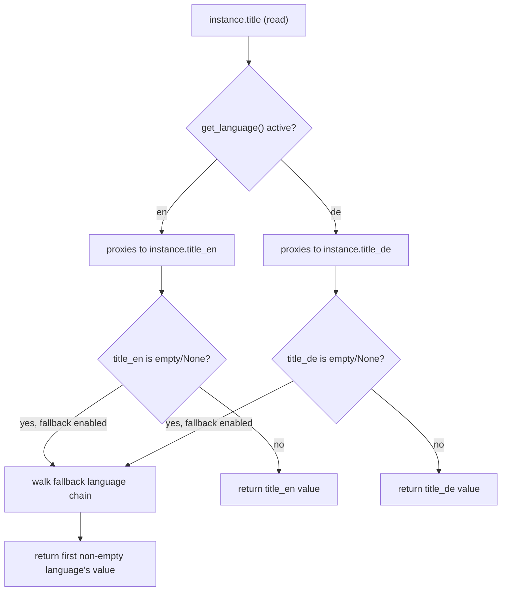
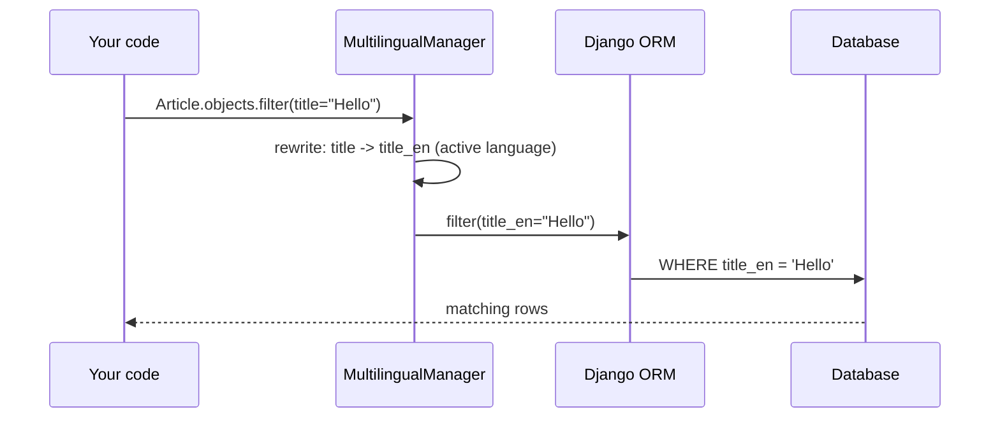
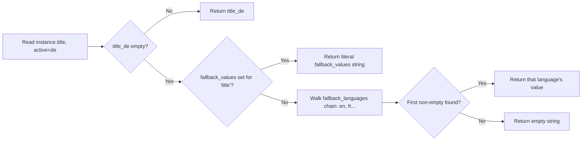
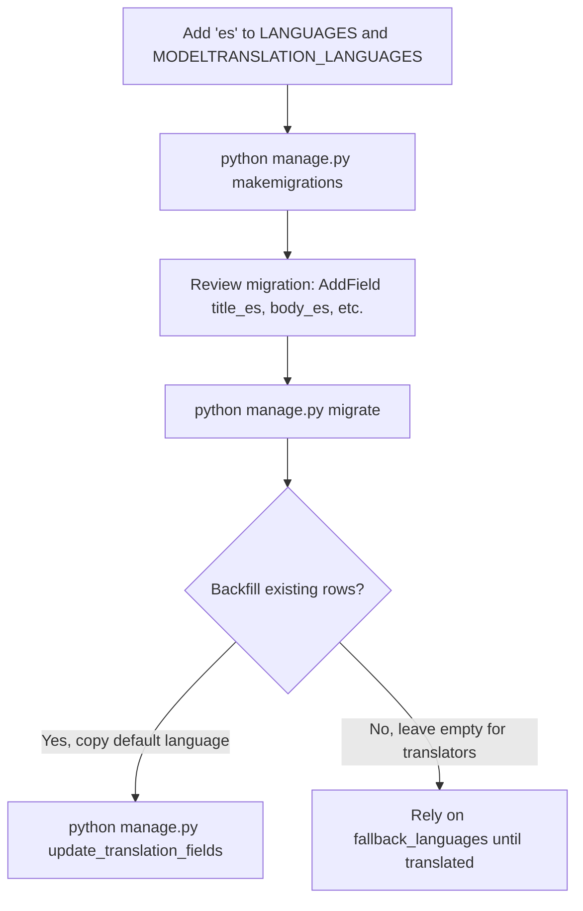

# django-modeltranslation: A Field-Level Translation Reference

> This guide covers `django-modeltranslation`, the registration-based library that adds per-language columns to existing Django models so you can store translated content in the same table without touching model classes. It assumes you already know Django's ORM, admin, migrations, and forms, and is written for a senior engineer onboarding onto this specific library, not onto Django or i18n in general. Verified current as of **2026-07-22** against PyPI (`django-modeltranslation` 0.20.3, released 2026-04-14, requires Python `>=3.10,<4`). The library's own compatibility matrix (which Django versions 0.20.x is tested against) is maintained in the repo's CI config rather than PyPI classifiers, and I could not fully confirm the exact Django ceiling from public metadata alone — check `tox.ini` / GitHub Actions matrix in the repo before pinning in a new project, particularly if you're on Django 5.2 or 6.0.

---

## Table of Contents

1. [Concepts — How It Actually Works](#concepts)
2. [Decision / Orientation](#decision)
3. [Installation & Configuration](#installation)
4. [Registering Models for Translation](#registration)
5. [Field Access, the Rewrite Layer, and Querying](#field-access)
6. [Fallbacks and Auto-Population](#fallbacks)
7. [Admin Integration](#admin)
8. [Forms, DRF Serializers, and the API-Layer Fork](#forms)
9. [Migrations and Adding a Language Later](#migrations)
10. [Scaling / Production Concerns](#production)
11. [Security Checklist](#security)
12. [Testing](#testing)
13. [Common Errors & Fixes](#errors)
14. [Anti-Patterns](#anti-patterns)
15. [Quick Reference / Cheat Sheet](#cheatsheet)
16. [References & Further Reading](#references)

---

## 1. Concepts — How It Actually Works {#concepts}

modeltranslation does **not** create a separate translation table. It works by dynamically adding one physical column per translated field per language to the *same* database table, then patching the model class so that accessing the original field name transparently proxies to whichever language column matches the currently active Django locale.

If you register `title` on a model for languages `en` and `de`, the library adds `title_en` and `title_de` columns to the table (via descriptors added at class-definition time, materialized into the DB by a normal migration). The original `title` attribute becomes a descriptor: reading `instance.title` resolves to `instance.title_en` or `instance.title_de` depending on `django.utils.translation.get_language()` at the moment of access — not at save time, not at request-start time, but at the exact moment the attribute is read.



This is the single mental model that explains almost every behavior downstream:

- **Why no joins are needed for reads.** All languages live on the same row, so `Article.objects.all()` is one query regardless of how many languages you support. This is the library's core selling point over sibling-table approaches.
- **Why `save()` semantics matter.** Setting `instance.title = "Hello"` while `en` is active writes to `title_en`. If you set `instance.title` while a *different* language is active by mistake (e.g., in a management command run under the wrong locale), you silently write into the wrong column — this is the single most common bug new users hit.
- **Why migrations are required per language.** Adding a language to `MODELTRANSLATION_LANGUAGES` doesn't add a column by itself; it changes what fields modeltranslation *tells Django's migration framework exist*. You still run `makemigrations` — the columns are real, tracked, ordinary Django fields from Django's point of view once registered.
- **Why the admin "just works."** modeltranslation patches `ModelAdmin` classes for registered models (if you use its own `TranslationAdmin` or mixin) so form fields split automatically into per-language inputs, without you declaring `title_en`/`title_de` explicitly in `fields`.

### Vocabulary

| Term | Meaning |
|---|---|
| **Registration** | Declaring, via `translation.py` + `@register`, which model fields get translated and into which languages. Nothing is translated until registered. |
| **Translation field** | The physical per-language column (`title_en`, `title_de`). Real Django model fields, auto-generated. |
| **Original field / accessor** | The undecorated attribute name (`title`) that becomes a language-aware descriptor after registration. |
| **Default language** | The language whose column is authoritative when you query using the plain, un-suffixed field name in `filter()`/`order_by()` in certain configurations, and the language new untranslated data assumes if none is set. |
| **Fallback languages** | The ordered list of languages modeltranslation walks through when the active language's field is empty, before giving up and returning empty. |
| **`rewrite`** | The QuerySet-level mechanism that transparently rewrites `filter(title=...)` into `filter(title_en=...)` (or whichever is active) so ORM code written against the "unaware" field name still works. |

---

## 2. Decision / Orientation {#decision}

Before writing code, place yourself on two axes: **which storage strategy fits your project**, and **which piece of your stack needs a translation-aware layer**.

### Storage strategy: is modeltranslation even the right tool?

This is the platform-level fork with no in-between — pick your storage architecture once, early, because migrating between strategies later means a real data migration, not a config change.

| Approach | How it stores data | Choose when |
|---|---|---|
| **modeltranslation** (this guide) | One column per field per language, same table | Fixed, known-at-deploy-time language set (rarely changes); read-heavy; you want zero-join queries and full ORM `filter`/`order_by` support per language |
| **django-modeltrans** | One `JSONField` holding all languages for a model | Language set changes often (no migration per new language); Postgres-only is acceptable; you can tolerate JSON-query syntax for filtering |
| **Parler (django-parler)** | Separate translation table per model, one row per (object, language) | Language set is large/dynamic; you're fine paying a join per read; you want translations to be independently createable/deletable rows |
| **Hand-rolled sibling table** | Your own `ArticleTranslation` FK'd to `Article` | You need translation-specific metadata (translator, review status, per-translation timestamps) that doesn't fit any library's model |

This is a genuine architectural choice, not a stylistic one — modeltranslation's core assumption (fixed language set, columns per language) is fundamentally incompatible with "let admins add a new UI language without a deploy," and no configuration flag changes that.

### Within modeltranslation: which piece needs translation-awareness

| Layer | Is it automatic? | What you do |
|---|---|---|
| ORM read/write via model instances | Yes, automatic once registered | Nothing — `instance.title` just works |
| `QuerySet.filter()`/`order_by()` on original field name | Yes, via query rewriting | Nothing, but know it's happening (Section 5) |
| Django Admin | Semi-automatic | Swap `admin.ModelAdmin` → `TranslationAdmin` |
| Django Forms (non-admin) | No | Use `TranslationModelForm` or explicit per-language fields |
| DRF serializers | No | Explicit per-language fields or a custom serializer mixin (Section 8 — genuine fork, both shown) |
| Migrations | Semi-automatic | `makemigrations` after registering/adding a language — the columns are ordinary, but *you* trigger this |

---

## 3. Installation & Configuration {#installation}

### Verified current versions (checked 2026-07-22)

| Package | Version | Notes | Last checked |
|---|---|---|---|
| `django-modeltranslation` | 0.20.3 | Latest stable, released 2026-04-14 | 2026-07-22 (PyPI) |
| Python | `>=3.10, <4` | Per PyPI `Requires` metadata; wheels built/tested through 3.14 | 2026-07-22 (PyPI classifiers) |
| Django | Not fully confirmable from PyPI metadata alone | The project's classifiers list only `Framework :: Django` without version pins; consult the repo's CI matrix (`.github/workflows`) for the exact supported range before deploying against a brand-new Django release | 2026-07-22 |

```bash
pip install django-modeltranslation
```

### `settings.py`

```python
INSTALLED_APPS = [
    # ...
    "modeltranslation",   # must come BEFORE django.contrib.admin if you use TranslationAdmin
    "django.contrib.admin",
    # ...
]

# The site-wide language list Django itself uses (i18n_patterns, LocaleMiddleware, etc.)
LANGUAGES = (
    ("en", "English"),
    ("de", "German"),
    ("fr", "French"),
)

# Optional: only translate a subset of LANGUAGES, or translate into languages
# the site itself isn't rendered in (e.g. content prepared ahead of a launch).
# If omitted, modeltranslation translates into everything in LANGUAGES.
MODELTRANSLATION_LANGUAGES = ("en", "de", "fr")

# Which language's column is authoritative for admin default / untranslated legacy rows.
# Defaults to the first entry in LANGUAGES if unset.
MODELTRANSLATION_DEFAULT_LANGUAGE = "en"

# Where modeltranslation looks for translation.py files. Default is fine unless
# you keep translation declarations somewhere non-standard.
MODELTRANSLATION_TRANSLATION_FILES = (
    "articles.translation",
)

# Fallback languages — see Section 6. Global default; can be overridden per model.
MODELTRANSLATION_FALLBACK_LANGUAGES = ("en",)

# Quiets the "Registered N models for translation" stdout message from runserver.
MODELTRANSLATION_DEBUG = False
```

**Why `INSTALLED_APPS` ordering matters:** modeltranslation patches `django.contrib.admin`'s model registration machinery at app-loading time to make `TranslationAdmin` behave correctly with respect to field discovery. If `modeltranslation` loads after `django.contrib.admin` has already imported admin modules that reference translated fields, you can hit `AttributeError` on fields that "should" exist. Putting it first is the documented, safe ordering — this isn't a style preference, it's how Django's app registry loads apps in declaration order and modeltranslation depends on that order.

**Failure mode if misunderstood:** `MODELTRANSLATION_LANGUAGES` set to something not present in `LANGUAGES` translates content into a language nobody can select on the frontend (harmless but wasted columns); the reverse (a language in `LANGUAGES` but not `MODELTRANSLATION_LANGUAGES`) means the site accepts that locale but every translatable field silently falls back to the default language forever — a support ticket waiting to happen, since nothing errors.

---

## 4. Registering Models for Translation {#registration}

Create `translation.py` in the app containing the model — modeltranslation autodiscovers this filename the same way Django admin autodiscovers `admin.py`.

```python
# articles/models.py
from django.db import models

class Article(models.Model):
    title = models.CharField(max_length=255)
    body = models.TextField()
    slug = models.SlugField(unique=True)
    published_at = models.DateTimeField(auto_now_add=True)
```

```python
# articles/translation.py
from modeltranslation.translator import register, TranslationOptions
from .models import Article

@register(Article)
class ArticleTranslationOptions(TranslationOptions):
    fields = ("title", "body")
    # slug and published_at are intentionally excluded — see anti-patterns (§14)
    # for why translating slugs is almost always a mistake.
```

Run migrations exactly as you would for any other model change:

```bash
python manage.py makemigrations articles
python manage.py migrate
```

Inspect the generated migration — you'll see ordinary `AddField` operations for `title_en`, `title_de`, `title_fr`, `body_en`, `body_de`, `body_fr`. There is no custom migration operation type; this is deliberate, so that Django's standard migration tooling (squashing, `--fake`, reverse migrations) works unmodified.

### Layered behavior: `TranslationOptions` attributes

modeltranslation's registration options are layered — each one solves a problem the layer below it can't:

| Option | What it controls | What it can't do |
|---|---|---|
| `fields` | Which fields get per-language columns at all | Doesn't control *which* languages — that's global/`MODELTRANSLATION_LANGUAGES` |
| `fallback_languages` | Per-*model* override of the fallback chain | Can't be set per-field within the same model in older config styles — same chain applies to every field on the model unless you override per field (see below) |
| `fallback_values` | A literal placeholder (e.g., `"(no translation)"`) instead of falling back to another language | Doesn't distinguish "field is empty" from "field was never translated" — both look identical |
| `fallback_undefined` | Marks specific fields to use `None`/a sentinel instead of empty string when untranslated, so you can distinguish "empty on purpose" from "not translated yet" | Requires you to explicitly check for the sentinel everywhere you read the field — easy to forget in templates |

```python
@register(Article)
class ArticleTranslationOptions(TranslationOptions):
    fields = ("title", "body")
    fallback_languages = {"default": ("en",), "de": ("en", "fr")}
    fallback_values = {"title": "(untitled)"}
```

**The mechanism that most people misunderstand:** registration happens once, at import time, when Django loads `translation.py`. If you add a field to `fields` on an already-deployed model, existing rows do **not** retroactively get content in the new field's other-language columns — they get empty columns via the migration, same as adding any nullable/blank field. Auto-population (populating a new language from an existing default-language value) is opt-in and explicit, not automatic:

```python
python manage.py update_translation_fields  # copies default-language value into empty fields for other languages
```

**Failure mode:** running `update_translation_fields` after already having *real* translations in some rows and empty ones in others will overwrite nothing that's non-empty — it only fills genuinely empty fields — but teams often assume it's a one-time bootstrapping step and forget to re-run it after adding a language mid-project, leaving months of new content untranslated-by-default in the new language until someone notices.

---

## 5. Field Access, the Rewrite Layer, and Querying {#field-access}

### Reading and writing

```python
from django.utils import translation

article = Article.objects.get(pk=1)

with translation.override("de"):
    article.title = "Hallo Welt"   # writes to title_de
    article.save()

with translation.override("en"):
    print(article.title)           # reads title_en (unaffected by the write above)
```

You can also bypass the active-language proxy entirely and address a specific language column directly — useful in management commands, imports, and admin customizations where you don't want ambient locale state to matter:

```python
article.title_de = "Hallo Welt"   # explicit, no dependency on translation.override()
article.save()
```

**This is the pattern to prefer in any code that isn't request-scoped** (Celery tasks, management commands, migrations' `RunPython`), because `get_language()` inside a background task often silently returns the project's `LANGUAGE_CODE` default rather than anything meaningful, and code that implicitly relies on `translation.override()` context managers in a Celery task is a recurring source of "why did this save into the wrong language" bugs.

### Query rewriting



Every registered model's default manager is replaced with a `MultilingualManager` (custom managers you define are wrapped, not discarded — their methods still work, but querying against translated field names on them gets the same rewrite). This means `Article.objects.filter(title="Hello")` is rewritten, at query-build time, to filter on `title_en` (or whatever language is active) — you do **not** need to write `filter(title_en=...)` yourself unless you specifically want a fixed language regardless of request locale.

```python
# Language-aware (rewritten to whichever language is active for this request):
Article.objects.filter(title__icontains="hello")

# Language-pinned (bypasses rewriting, always queries the German column
# regardless of active language):
Article.objects.filter(title_de__icontains="hallo")
```

**Failure mode:** `order_by("title")` inside a management command or Celery task run with no active language context sorts against the *default* language's column, which is very often not what a translator or ops engineer expects when they assumed it'd sort by "whatever language this row happens to have."

### `Q` objects and `annotate`/`aggregate`

Q objects on translated fields are rewritten the same way filter() is:

```python
from django.db.models import Q
Article.objects.filter(Q(title__icontains="hello") | Q(body__icontains="hello"))
```

`annotate()`/`aggregate()` referencing a translated field name are **not** rewritten in all versions — this is a known sharp edge, not a design guarantee. If an aggregate silently returns `None` or an unexpected count, address the underlying language-suffixed column explicitly (`Count("title_en")`) rather than assuming the rewrite layer covers every ORM entry point.

---

## 6. Fallbacks and Auto-Population {#fallbacks}

Fallbacks answer "what do we show when the active language's column is empty." Two independent, composable mechanisms exist:



- **`fallback_languages`**: an ordered chain of *other languages* to check when the active one is empty. This is the right tool when "show it in English rather than show nothing" is acceptable UX.
- **`fallback_values`**: a literal placeholder string, bypassing the chain entirely. Right tool when you'd rather show "Translation pending" than silently show English copy that a French user might not notice is the wrong language.

These are mutually exclusive per field in practice — if both are configured, `fallback_values` wins for that field, since the point of setting a literal value is to *not* fall through to another language.

**Auto-population** (`MODELTRANSLATION_AUTO_POPULATE`) is a different mechanism: it controls what happens the instant you *save a new field value* on the default/original accessor without an active-language override — should it copy that value into every registered language's column immediately, or only the current one?

```python
MODELTRANSLATION_AUTO_POPULATE = False  # default: only the active language's column is set
# or "all" — every language column gets the same value on creation, useful for
# seed/fixture data you'll translate incrementally afterward
```

**Choose `fallback_languages` when:** partial translation is expected to be permanent (a small site that will realistically never translate every article into every language).
**Choose `fallback_values` when:** you need translators/editors to see an obvious "not yet translated" signal rather than accidentally-plausible English content leaking into another locale.
**Choose `AUTO_POPULATE = "all"` when:** bootstrapping a dataset where every language should start identical and diverge over time (e.g., legal boilerplate copied to all locales, then translated by hand later).

---

## 7. Admin Integration {#admin}

```python
# articles/admin.py
from django.contrib import admin
from modeltranslation.admin import TranslationAdmin
from .models import Article

@admin.register(Article)
class ArticleAdmin(TranslationAdmin):
    list_display = ("title", "slug", "published_at")
    # No need to list title_en, title_de, etc. explicitly — TranslationAdmin
    # expands 'title' into per-language fieldsets automatically.
```

`TranslationAdmin` replaces each translated field in the change form with one input per configured language, grouped visually, and patches `list_display`/`list_editable`/`search_fields` so they still work when you reference the *original* field name rather than every language variant.

For `TabularInline`/`StackedInline` on translated models, use `TranslationTabularInline`/`TranslationStackedInline` — the plain Django inline classes don't get the field-expansion behavior, since inline formsets are constructed through a different code path than the main `ModelAdmin` form.

**Layer that's easy to miss:** if you use a *custom* `ModelForm` in your `ModelAdmin.form`, `TranslationAdmin` doesn't automatically make your custom form language-aware — you need `TranslationModelForm` as a base (or mix it in) or the language expansion silently doesn't apply to your custom form's fields, even though the admin list view still looks fine.

```python
from modeltranslation.admin import TranslationAdmin
from modeltranslation.forms import TranslationModelForm

class ArticleAdminForm(TranslationModelForm):
    class Meta:
        model = Article
        fields = "__all__"

class ArticleAdmin(TranslationAdmin):
    form = ArticleAdminForm
```

---

## 8. Forms, DRF Serializers, and the API-Layer Fork {#forms}

Outside the admin, modeltranslation does **not** automatically translate your forms or serializers — this is the biggest genuine fork in the ecosystem, because there are two legitimate, differently-shaped ways to expose translated fields through a non-admin API, and picking wrong costs you a rewrite.

### Fork: plain Django Forms

**Option A — `TranslationModelForm`:** exposes every language's column as its own form field, same shape as the admin.

```python
from modeltranslation.forms import TranslationModelForm

class ArticleForm(TranslationModelForm):
    class Meta:
        model = Article
        fields = ["title", "body", "slug"]
        # renders as title_en, title_de, title_fr, body_en, body_de, body_fr, slug
```

**Option B — plain `ModelForm` addressing the active-language proxy only:**

```python
from django import forms

class ArticleForm(forms.ModelForm):
    class Meta:
        model = Article
        fields = ["title", "body", "slug"]
        # renders ONE title field and ONE body field, bound to whatever
        # language is active for the current request
```

| | Option A: `TranslationModelForm` | Option B: plain `ModelForm` |
|---|---|---|
| Editor sees | All languages at once, one form | Only the request's active language |
| Right for | Internal CMS/back-office editing, translators working across languages side-by-side | Public-facing "edit your profile bio" style forms, one language per session |
| Cost | More fields to validate/render per submission | Requires N separate requests (one per language) to fully translate a record |

### Fork: DRF serializers

DRF has no first-party modeltranslation integration; there is no single "obviously correct" default here, so both real patterns are shown in full.

**Pattern A — expose every language explicitly (flat, mirrors admin):**

```python
from rest_framework import serializers
from .models import Article

class ArticleSerializer(serializers.ModelSerializer):
    class Meta:
        model = Article
        fields = ["id", "slug", "title_en", "title_de", "title_fr",
                  "body_en", "body_de", "body_fr"]
```

Clients receive/send every language in one payload. Right for admin-facing internal tools and bulk-import APIs.

**Pattern B — active-language proxy (mirrors what a public site visitor sees):**

```python
class ArticleSerializer(serializers.ModelSerializer):
    title = serializers.CharField()   # bound to the active-language descriptor
    body = serializers.CharField()

    class Meta:
        model = Article
        fields = ["id", "slug", "title", "body"]
```

Combined with `LocaleMiddleware` or an `Accept-Language`-driven view, this returns exactly one language's content per request — right for public-facing content APIs where the client shouldn't need to know the site's full language list.

**Never silently pick one for a public API without documenting it** — a client integrating against Pattern B assuming Pattern A's shape (or vice versa) will either receive unexpected `title_en`/`title_de` keys or get only one language and wonder where the others went. This is exactly the kind of fork the platform doesn't resolve for you; document which one your API uses in the endpoint's own docs, not just in this guide.

---

## 9. Migrations and Adding a Language Later {#migrations}

Adding a language to an already-deployed project is a normal but multi-step operation — treat it like any schema change with a data-backfill step, because that's what it is.



```bash
python manage.py makemigrations articles
python manage.py migrate
python manage.py update_translation_fields   # optional bootstrap, see §4
```

**Reverse migrations:** rolling back an `AddField` migration for a translated column drops the column and its data outright, same as any Django field removal — there is nothing modeltranslation-specific here, but teams sometimes assume translation columns are "safer" to roll back because they're auto-generated. They are ordinary columns; back up before a rollback in production exactly as you would for any destructive migration.

**Renaming a registered field:** Django's migration autodetector cannot see through modeltranslation's dynamic field injection reliably in a rename — a field rename on the base model (`title` → `headline`) does not automatically rename `title_en`/`title_de` to `headline_en`/`headline_de`. You'll typically get `RemoveField`/`AddField` pairs (data loss) instead of a clean `RenameField` unless you hand-write the migration to rename each per-language column explicitly.

---

## 10. Scaling / Production Section {#production}

**Table width.** Every translated field costs one column per language. A model with 8 translated fields across 12 languages is 96 extra columns on that table. This is not a performance problem for typical row counts (Postgres/MySQL handle wide rows fine), but it is a *schema legibility* problem — `\d articles` in `psql` becomes unreadable, and every raw SQL query, ETL job, or BI tool touching that table now has to know about language suffixes. Mitigate by keeping translated field *count* per model deliberately small (translate `title`/`body`, not every minor label), and by using database views or explicit column lists in analytics queries rather than `SELECT *`.

**Query rewriting cost.** The rewrite in Section 5 happens in Python at query-construction time, not at the database — by the time SQL is generated, it's an ordinary column reference, so there's no runtime overhead versus hand-writing `filter(title_en=...)` yourself. The mechanism to worry about is correctness (are you filtering the language you think you are), not latency.

**Cache keys.** If you cache serialized objects (template fragments, DRF responses, `cache.set` on a queryset), the cache key **must** include the active language, or you will serve English content to a French-locale request that happened to warm the cache first. This is the single most common production bug with any field-level i18n approach, modeltranslation included — it isn't a modeltranslation bug, but the library gives you no automatic protection against it since it works at the ORM layer, below where most caching decisions get made.

```python
cache_key = f"article:{article.pk}:{translation.get_language()}"
```

**Bulk operations.** `bulk_create`/`bulk_update` bypass model `save()`, and therefore bypass the active-language write-proxy entirely — you must address language columns explicitly (`title_en=...`) in bulk operations; there is no "active language" concept in a bulk insert since it isn't tied to a request.

**Search indexing.** If you feed content into Elasticsearch/Postgres full-text search, index each language column into its own analyzer-appropriate field (`title_en` → English analyzer, `title_de` → German analyzer with compound-word handling) — indexing the active-language-proxy value means your search index silently only reflects whatever language happened to be active when the indexing job ran, not per-object per-language content.

---

## 11. Security Checklist {#security}

- [ ] Confirm `MODELTRANSLATION_LANGUAGES` is a strict subset of, or equal to, `LANGUAGES` — a mismatch doesn't cause a vulnerability directly, but silently-empty fields falling back to unexpected content is a data-integrity issue that has shipped as a "we showed the wrong country's legal text" incident on other i18n stacks; treat the setting pair as one unit to review together.
- [ ] Audit any DRF serializer or custom view that exposes per-language fields (Pattern A in §8) for **field-level permission leakage** — a serializer listing `title_en, title_de, title_fr` will happily return an unpublished/draft translation in a language your moderation workflow hasn't reviewed yet, if you only gate publication status on the object level and not per-language.
- [ ] If translated fields are rendered without escaping assumptions changing per language (RTL languages, CJK), confirm your template layer's autoescaping still applies uniformly — modeltranslation returns plain Python strings from whichever column is active; it does no sanitization itself, so existing XSS protections (Django's autoescaping, `bleach` on rich-text fields) must already cover every language column, not just the default one. A common gap: rich-text sanitization pipelines wired up against the plain `body` field in code review, then someone adds a new language whose column bypasses that pipeline because it was added directly via `body_de = ...` in an import script rather than through the sanitizing form.
- [ ] Review admin `TranslationAdmin` field permissions if you use per-field or per-object permission backends — because each language becomes a *separate* form field, a permission check written against `"articles.change_title"` does not automatically cover `title_de`; verify your permission backend enumerates the generated language fields rather than only the original field name.
- [ ] No CVE or supply-chain disclosure specific to `django-modeltranslation` was found as part of this check (searched PyPI advisory data and the project's GitHub Security tab as of 2026-07-22) — this is a "checked, nothing found" state, not a "confirmed clean forever" guarantee. Re-check `pip-audit`/`safety`/GitHub Dependabot output on your own lockfile before shipping, since this guide's check is a point-in-time snapshot.

---

## 12. Testing {#testing}

The non-obvious gotcha with testing modeltranslation code is that **test isolation and active-language state don't automatically reset together** — `translation.override()` is a context manager, and if a previous test left the thread-local active language in a non-default state (e.g., via a view that calls `translation.activate()` without a matching `deactivate()`), a later test asserting on `instance.title` can read the wrong column and produce a flaky, order-dependent failure.

```python
from django.test import TestCase
from django.utils import translation
from articles.models import Article

class ArticleTranslationTests(TestCase):
    def test_title_resolves_active_language(self):
        article = Article.objects.create(title_en="Hello", title_de="Hallo")

        with translation.override("en"):
            self.assertEqual(article.title, "Hello")

        with translation.override("de"):
            self.assertEqual(article.title, "Hallo")

    def test_fallback_to_default_language(self):
        # title_fr intentionally left empty
        article = Article.objects.create(title_en="Hello")

        with translation.override("fr"):
            # Assumes fallback_languages includes "en" for this model
            self.assertEqual(article.title, "Hello")

    def test_bulk_create_bypasses_active_language(self):
        Article.objects.bulk_create([Article(title_en="A", title_de="B")])
        article = Article.objects.get(title_en="A")
        self.assertEqual(article.title_de, "B")
```

**Other non-obvious test setup issues:**

- Factories (e.g., `factory_boy`) that only set the original field name (`title="Foo"`) will only populate whichever language was active at factory-call time — tests asserting on a *different* language's content from that factory will see empty strings, not a factory bug. Set `title_en=`, `title_de=` explicitly in factories that need multiple languages populated for a single test object.
- `override_settings(MODELTRANSLATION_LANGUAGES=(...))` does **not** retroactively change already-registered translation options for the duration of a test — registration happens at Django app-loading time, before test settings overrides apply, so tests that need a different language set require restructuring the app-loading fixtures, not a settings override at test time.
- Admin tests using Django's test client against a `TranslationAdmin` change form must post *all* expanded per-language field names (`title_en`, `title_de`, ...), not just `title` — posting only the original field name against the admin's change view will fail form validation with "this field is required" for the other language inputs the form actually rendered.

---

## 13. Common Errors & Fixes {#errors}

| Error | Root Cause | Fix |
|---|---|---|
| `FieldError: Cannot resolve keyword 'title' into field` (in raw SQL/`.extra()`/`.raw()`) | Query rewriting only operates on the standard QuerySet API; raw SQL and `.raw()` see the real schema, which has no `title` column, only `title_en`/`title_de` | Reference the language-suffixed column name directly in raw SQL |
| `ImproperlyConfigured: translation for model X is already registered` | `@register(Model)` called twice — usually from `translation.py` being imported both via autodiscovery and an explicit import elsewhere | Remove the duplicate import; only import translation modules through modeltranslation's autodiscovery, not manually in `apps.py`/`models.py` |
| Admin form: "This field is required" on a language you didn't intend to edit | `TranslationAdmin` expanded a field into multiple required inputs, and one language's `blank=False` constraint fired even though you only meant to fill in the default language | Set `blank=True` on the base field if partial translation should be allowed, or supply `fallback_values`/auto-populate before making the field required |
| `AttributeError: 'Article' object has no attribute 'title_es'` after adding a language | Migration for the new language column wasn't generated/applied before code referencing it deployed | Run `makemigrations`/`migrate` for the new language before deploying code that reads/writes `title_es` |
| Data appears to "disappear" after switching `MODELTRANSLATION_DEFAULT_LANGUAGE` | Existing code that reads `instance.title` outside any `translation.override()` now resolves to a different column than before, and that column happens to be empty for old rows | Run `update_translation_fields` to backfill the new default language column, or add the old default to `fallback_languages` |
| `bulk_update` doesn't reflect the value you set via `instance.title = "..."` | Same as the bulk-create gotcha — `bulk_update` serializes model fields directly and doesn't invoke the descriptor-based write proxy the same way `save()` does in all versions | Set the language-suffixed attribute explicitly (`instance.title_en = "..."`) before calling `bulk_update` |
| Search/filter returns nothing for content you can see in the admin | `.filter(title=...)` rewritten against the *active* language for the request, which differs from the language the content was entered in | Either activate the correct language before filtering, or filter the specific language column directly (`title_de=...`) |

---

## 14. Anti-Patterns {#anti-patterns}

- **Translating the slug.** A translated `SlugField` means `article.slug` resolves to a different URL-segment value depending on active language, which breaks any code assuming a stable canonical URL per object (sitemaps, hreflang tags, cache keys built from slug). If you need localized URLs, model them as an explicit, separate mapping — don't reach for modeltranslation on the slug field just because it's convenient.
- **Relying on `instance.title` inside Celery tasks/management commands without setting the language explicitly.** `get_language()` in a non-request context frequently resolves to `settings.LANGUAGE_CODE` regardless of "which language this data logically belongs to," producing writes into the wrong column that look correct in local testing (where you're usually running under your own browser's active locale) and wrong in production background workers.
- **Treating `fallback_languages` as a substitute for actually translating content.** Fallbacks are a UX safety net for gaps, not a translation strategy — teams that never revisit "temporarily" English-fallback content end up shipping a site that claims to support a language but silently doesn't, for months, because nothing ever errors.
- **Exposing every `title_xx` column in a public API "for completeness."** This leaks unpublished/unreviewed translations to end users the moment a translator saves a draft, since column-level exposure has no concept of per-language review status unless you build that gating yourself (§11).
- **Forgetting `update_translation_fields` after adding a language mid-project, then being surprised months later that all "new" content has empty columns in the newest language** while assuming fallback silently and permanently covers the gap — fallback is a read-time patch, not a data-completeness guarantee, and stakeholders reviewing "language coverage" reports will see genuinely empty columns if asked to query directly.
- **Writing raw SQL/reporting queries against `SELECT *`** on a heavily-translated table and being confused when the row shape has 40 more columns than the model's field count suggests — always project explicit column lists once a table has more than a couple of translated fields.

---

## 15. Quick Reference / Mental Model Cheat Sheet {#cheatsheet}

**Core mental model:** one column per field per language, same table. Reading `instance.title` proxies to `title_<active_language>` at access time; `filter()`/`order_by()` on the original name get rewritten the same way. Nothing about this happens automatically outside model instances and QuerySets — forms, serializers, bulk operations, raw SQL, and background tasks all need you to address language columns explicitly.

```python
# Always set explicitly:
INSTALLED_APPS = ["modeltranslation", "django.contrib.admin", ...]  # order matters
MODELTRANSLATION_LANGUAGES = (...)     # subset of LANGUAGES
MODELTRANSLATION_DEFAULT_LANGUAGE = "en"
MODELTRANSLATION_FALLBACK_LANGUAGES = ("en",)
```

```bash
# After registering a model or adding a language:
python manage.py makemigrations
python manage.py migrate
python manage.py update_translation_fields   # optional backfill
```

- Model instance read/write → automatic, language-aware
- `filter()`/`order_by()` on original field name → automatic, rewritten
- Admin → `TranslationAdmin` / `TranslationTabularInline`
- Non-admin forms → `TranslationModelForm` (all languages) or plain `ModelForm` (active language only) — pick deliberately
- DRF → no default; explicit per-language fields or active-language proxy, document which
- `bulk_create`/`bulk_update`/raw SQL/Celery tasks → **always** address `field_<lang>` explicitly, never rely on active-language state
- Cache keys touching translated content → must include the active language

---

## 16. References & Further Reading {#references}

**Official docs/specs**
- [django-modeltranslation documentation](https://django-modeltranslation.readthedocs.io/en/latest/) — the canonical reference for settings, registration options, and admin integration; more current than the README for edge-case configuration flags.
- [PyPI project page](https://pypi.org/project/django-modeltranslation/) — authoritative for current released version and Python compatibility metadata.

**Source code worth reading**
- [`modeltranslation/manager.py` on GitHub](https://github.com/deschler/django-modeltranslation) — the `MultilingualManager`/query-rewriting implementation; reading it clarifies exactly which QuerySet methods get rewritten and which don't (relevant to the `annotate`/`aggregate` sharp edge in §5) far better than any prose summary.
- [`modeltranslation/fields.py` on GitHub](https://github.com/deschler/django-modeltranslation) — the descriptor implementation behind the active-language read/write proxy described in §1.

**Community/ecosystem**
- [GitHub Issues](https://github.com/deschler/django-modeltranslation/issues) — where the bulk-operation and migration-autodetection edge cases in this guide are actively discussed by maintainers and users hitting them in production.
- [CHANGELOG.md](https://github.com/deschler/django-modeltranslation/blob/master/CHANGELOG.md) — check before upgrading across minor versions; several past releases have changed fallback/auto-populate default behavior.

**Deep dives**
- [Django Packages: Model Translation grid](https://djangopackages.org/grids/g/model-translation/) — a maintained side-by-side comparison of modeltranslation against django-modeltrans, Parler, and other approaches referenced in the decision table in §2, useful if you're re-litigating the storage-strategy choice for a new project.
