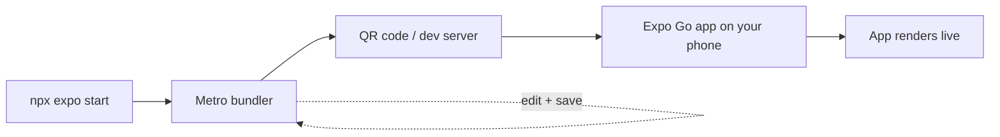
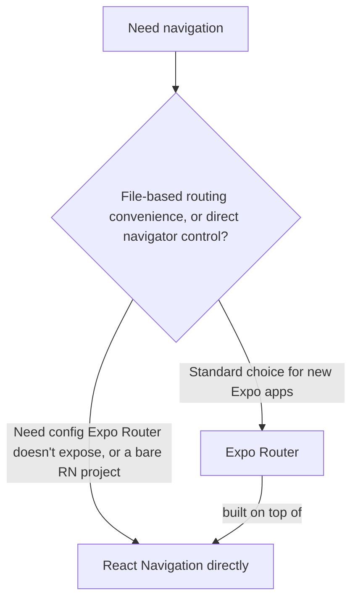
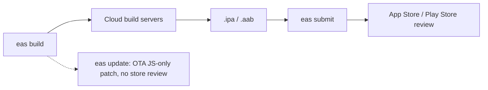

# A Complete Introduction to Building Mobile Apps with Expo (With Tool Options)

> This is a from-scratch, hands-on guide to building real mobile apps with Expo, using the ecosystem's actual standard tools — not web tooling like Vite bolted on where it doesn't apply (Expo uses Metro, not Vite, as its bundler; that's not a preference, it's a platform requirement). It assumes you already know React. Wherever a genuine tool choice exists in the Expo/React Native ecosystem, both options are explained and shown, rather than one being forced on you. Current as of **Expo SDK 56 (May 2026)**, **React Native 0.85**, and **TanStack Query 5.101** (the same data-fetching library from the web guide — it's platform-agnostic and works identically in React Native). Checked against expo.dev and library documentation, July 2026.

## Table of Contents

1. [The Stack: What's Standard, and Where You Actually Have a Choice](#stack)
2. [Setting Up Your Environment](#setup)
3. [Creating and Running Your First App](#first-app)
4. [Project Structure Explained](#structure)
5. [Styling: StyleSheet vs. NativeWind](#styling)
6. [Navigation: Expo Router vs. React Navigation Directly](#navigation)
7. [Server State with TanStack Query](#tanstack-query)
8. [Client State: Context vs. Zustand](#client-state)
9. [Forms](#forms)
10. [Building and Publishing: EAS](#building)
11. [Debugging and Developer Tools](#debugging)
12. [Cheat Sheet](#cheat-sheet)

---

## 1. The Stack: What's Standard, and Where You Actually Have a Choice {#stack}

Not everything in mobile development is a decision — some things are simply how the platform works, and presenting them as "options" would be misleading. Others are genuine forks where reasonable teams land differently. Here's which is which:

| Layer | Standard / required | Where you have a real choice |
|---|---|---|
| Bundler | **Metro** — Expo's bundler, not swappable for Vite or Webpack; mobile JS bundling has different constraints (bridging to native, Hermes bytecode) that Metro is built for | — |
| Native tooling / builds | **EAS (Build, Submit, Update)** — the standard managed path; bare React Native CI is the alternative if you need full native control | Covered in section 10 |
| Navigation | **Expo Router** is the current default for new Expo apps (file-based, built on top of React Navigation) | React Navigation directly is a legitimate choice for specific cases — section 6 |
| Styling | No single standard — `StyleSheet.create` (built-in) and NativeWind (Tailwind for React Native) are both widely used in production | Section 5 |
| Server state | TanStack Query (platform-agnostic, same library as web) | Fetching by hand is possible but not recommended, same reasoning as web |
| Client state | Component state + Context by default; Zustand once you need it | Section 8 |

**Pro tip:** don't assume every tool from a web React project ports over. Metro isn't a worse Vite — it solves a different problem (bundling for a JS engine embedded in a native app, not a browser), and there's no meaningful "switch to Vite for Expo" option, unlike routing or styling, which really are open choices.

---

## 2. Setting Up Your Environment {#setup}

You need:

- **Node.js** (20.x or 22.x LTS)
- **Expo Go** app on your phone (App Store / Play Store) — for instant testing with zero native build setup
- Optionally, Xcode (Mac, for iOS simulator) or Android Studio (for Android emulator)

```bash
node -v
npx create-expo-app@latest --version
```

You do not need a Mac to eventually build for iOS — EAS Build (section 10) handles that in the cloud.

**Pro tip:** don't install `expo-cli` globally; it's deprecated. Use `npx expo` per project, which always resolves to the version your project actually needs.

---

## 3. Creating and Running Your First App {#first-app}

```bash
npx create-expo-app@latest my-app
cd my-app
npx expo start
```

Scan the QR code with Expo Go, and your app runs live on your phone with Fast Refresh on every save.



**Pro tip:** phone and computer need the same Wi-Fi network. If that's blocked (common on locked-down networks), `npx expo start --tunnel` routes around it.

---

## 4. Project Structure Explained {#structure}

```
my-app/
├── app/                  # Screens, file-based routing (Expo Router)
│   ├── _layout.tsx
│   └── index.tsx
├── assets/               # Images, fonts, icons
├── app.json              # App identity: name, icon, splash, permissions
├── package.json
└── tsconfig.json
```

There's no `ios/`/`android/` folder by default — Expo generates those on demand via `expo prebuild` only if you need to touch native code directly. As the app grows, a common organization is:

```
src/ (or app/ mixed with)
├── routes/ or app/       # Expo Router screens
├── features/             # feature-based folders
├── components/           # shared UI
├── lib/                  # query client, API client, utilities
```

**Pro tip:** avoid creating native folders "just to look" early on — once they exist, some tooling assumes you're maintaining them yourself, which changes how `expo prebuild` and EAS Build behave.

---

## 5. Styling: StyleSheet vs. NativeWind {#styling}

This is a real, actively-discussed fork in the React Native ecosystem — not a case of one being outdated.

**Option A — `StyleSheet.create`** (built into React Native, zero install):

```jsx
import { View, Text, StyleSheet } from 'react-native';

export default function Card() {
  return (
    <View style={styles.card}>
      <Text style={styles.title}>Hello</Text>
    </View>
  );
}

const styles = StyleSheet.create({
  card: { padding: 16, borderRadius: 8, backgroundColor: '#fff' },
  title: { fontSize: 18, fontWeight: '600' },
});
```

**Option B — NativeWind** (Tailwind CSS syntax, compiled to native styles at build time):

```bash
npx expo install nativewind tailwindcss
```

```jsx
import { View, Text } from 'react-native';

export default function Card() {
  return (
    <View className="p-4 rounded-lg bg-white">
      <Text className="text-lg font-semibold">Hello</Text>
    </View>
  );
}
```

NativeWind compiles Tailwind utility classes into the equivalent of `StyleSheet.create` objects ahead of time — it's not adding a CSS engine to your app at runtime, so it's not a performance tradeoff against plain `StyleSheet` in the way "using CSS on mobile" might sound like it should be.

| | `StyleSheet.create` | NativeWind |
|---|---|---|
| Choose when | You want zero dependencies and React Native's native styling model exactly as documented | Your team already thinks in Tailwind (from web work), or you want consistent spacing/color scales enforced by a design-token system |
| Cost | More verbose; no built-in design-token constraints | One more dependency; utility-class-dense JSX |
| Cross-platform note | Native-only concept | If you ever add React Native Web, NativeWind outputs real CSS on web and `StyleSheet.create`-equivalent on native from the same class names |

**Pro tip:** if you're building an Expo app that also targets web via React Native Web, NativeWind's cross-platform output is a genuine practical advantage — plain `StyleSheet.create` doesn't have a web-native equivalent decision to make, since it's mobile-only by definition.

---

## 6. Navigation: Expo Router vs. React Navigation Directly {#navigation}

Expo Router is built **on top of** React Navigation — it's not a competing library, it's a file-based-routing layer over the same underlying navigation primitives. The choice is really "do you want the file-based convenience layer, or do you want to configure React Navigation's navigators directly."



**Option A — Expo Router** (the current default for new Expo apps):

```
app/
├── _layout.tsx
├── index.tsx             # "/"
└── posts/[id].tsx         # "/posts/:id"
```

```jsx
// app/posts/[id].tsx
import { useLocalSearchParams } from 'expo-router';
import { Text } from 'react-native';

export default function Post() {
  const { id } = useLocalSearchParams();
  return <Text>Post #{id}</Text>;
}
```

**Option B — React Navigation directly** (configuring navigators yourself, no file-based layer):

```bash
npx expo install @react-navigation/native @react-navigation/native-stack
```

```jsx
import { NavigationContainer } from '@react-navigation/native';
import { createNativeStackNavigator } from '@react-navigation/native-stack';

const Stack = createNativeStackNavigator();

export default function App() {
  return (
    <NavigationContainer>
      <Stack.Navigator>
        <Stack.Screen name="Home" component={Home} />
        <Stack.Screen name="Post" component={Post} />
      </Stack.Navigator>
    </NavigationContainer>
  );
}

function Post({ route }) {
  const { id } = route.params; // no compile-time route safety by default
  return <Text>Post #{id}</Text>;
}
```

| | Expo Router | React Navigation directly |
|---|---|---|
| Choose when | New Expo app, want deep linking and route structure derived automatically from your file layout | You need navigator configuration/behavior that Expo Router doesn't expose, or you're in a bare RN project without Expo | 
| Deep linking | Automatic — route file path is the link path | Manual linking config required |
| Learning resources | Newer, growing but smaller than React Navigation's long-established docs/tutorials | Much larger existing tutorial/StackOverflow base |

**Important, current-as-of-SDK-56 detail:** Expo Router now maintains its own fork of the React Navigation dependencies it uses internally — direct imports from `@react-navigation/*` inside an Expo Router project can break, because `expo-router` no longer lists `react-navigation` as a direct dependency. If you're using Option A, don't mix in direct React Navigation imports; if you need something React Navigation exposes that Expo Router doesn't, that's a signal you may want Option B for that specific screen/flow, not a reason to import both inconsistently.

**Pro tip:** most teams starting a new Expo app in 2026 should default to Expo Router — it's what `create-expo-app` scaffolds by default, and stepping down to raw React Navigation is something you do deliberately for a specific unmet need, not a coin flip at project start.

---

## 7. Server State with TanStack Query {#tanstack-query}

TanStack Query is platform-agnostic — the exact same library and API you'd use on web works identically in React Native/Expo, because it has no DOM or browser dependency; it's pure data-fetching/caching logic.

```bash
npx expo install @tanstack/react-query
```

```jsx
// App root
import { QueryClient, QueryClientProvider } from '@tanstack/react-query';

const queryClient = new QueryClient();

export default function App() {
  return (
    <QueryClientProvider client={queryClient}>
      <Navigation />
    </QueryClientProvider>
  );
}
```

```jsx
import { useQuery } from '@tanstack/react-query';
import { Text, FlatList } from 'react-native';

function Posts() {
  const { data, isPending, error } = useQuery({
    queryKey: ['posts'],
    queryFn: () => fetch('https://api.example.com/posts').then((r) => r.json()),
  });

  if (isPending) return <Text>Loading...</Text>;
  if (error) return <Text>Something went wrong.</Text>;
  return <FlatList data={data} keyExtractor={(p) => p.id} renderItem={({ item }) => <Text>{item.title}</Text>} />;
}
```

**Why this matters more on mobile than web, not less:** mobile network conditions are worse and more variable (cellular handoffs, tunnels, airplane mode), so TanStack Query's built-in retry logic, offline-aware refetching, and cache persistence matter as a baseline requirement, not an optimization. Hand-rolling this with `useEffect` on mobile reproduces the same race-condition and deduplication bugs as on web, with a less forgiving network to expose them.

**Pro tip:** pair TanStack Query with `@tanstack/query-async-storage-persister` if you want the cache to survive an app restart (e.g., showing cached data instantly on cold start before a fresh fetch completes) — this is a mobile-specific enhancement with no direct web equivalent need, since a web page reload already re-fetches fast enough that persisted cache matters less.

---

## 8. Client State: Context vs. Zustand {#client-state}

Identical reasoning to web — this isn't a mobile-specific decision, because Context's re-render behavior and Zustand's selector-based subscriptions work the same regardless of platform.

**Option A — Context** (built-in):

```jsx
const ThemeContext = createContext('light');
```

Fine for low-frequency, app-wide values (theme, authenticated user) — every consumer re-renders on any change, which is a non-issue if the value rarely changes.

**Option B — Zustand**:

```bash
npx expo install zustand
```

```jsx
import { create } from 'zustand';

const useAppStore = create((set) => ({
  theme: 'light',
  setTheme: (theme) => set({ theme }),
}));

function ThemeToggle() {
  const theme = useAppStore((state) => state.theme); // only re-renders on theme changes
  const setTheme = useAppStore((state) => state.setTheme);
  return <Pressable onPress={() => setTheme(theme === 'light' ? 'dark' : 'light')}><Text>{theme}</Text></Pressable>;
}
```

**Pro tip:** don't reach for Zustand preemptively on a new mobile app "because it might get complex" — most screens' state is genuinely local or fits fine in Context; add a store once you observe an actual re-render cost, the same rule as web.

---

## 9. Forms {#forms}

React Hook Form works identically in React Native — it's not DOM-dependent, just wired to whatever input component you give it via `Controller` (React Native's `TextInput` doesn't support `ref`-based registration quite like a web `<input>`, so it needs the explicit `Controller` wrapper rather than plain `register`).

```bash
npx expo install react-hook-form
```

```jsx
import { useForm, Controller } from 'react-hook-form';
import { TextInput, Pressable, Text } from 'react-native';

function SignupForm() {
  const { control, handleSubmit } = useForm();

  return (
    <>
      <Controller
        control={control}
        name="email"
        rules={{ required: true }}
        render={({ field: { onChange, value } }) => (
          <TextInput onChangeText={onChange} value={value} placeholder="Email" />
        )}
      />
      <Pressable onPress={handleSubmit((data) => console.log(data))}>
        <Text>Sign up</Text>
      </Pressable>
    </>
  );
}
```

**Pro tip:** the `Controller` requirement is the one real mobile-specific wrinkle versus the web guide's `register`-based examples — don't assume the web API ports 1:1; React Native's `TextInput` needs the explicit controlled wrapper.

---

## 10. Building and Publishing: EAS {#building}

There isn't a meaningful alternative to EAS for the standard managed-Expo path — it's the standard tool, not one option among several, so it's presented as such rather than artificially paired with an alternative.

```bash
npm install -g eas-cli
eas login
eas build:configure
eas build --platform ios       # or android, or both — cloud build, no Mac/Android Studio required
eas submit --platform ios
eas update --branch production --message "Fix crash on login"
```



**The one place a real alternative exists:** if you need pervasive native customization beyond what config plugins and the Expo Modules API cover, the alternative to "managed EAS builds" is a fully bare React Native workflow with your own CI (Xcode Cloud, Bitrise, Fastlane, or self-hosted). That's a bigger, deliberate decision — not a default to consider for a standard app.

**Pro tip:** stage OTA updates through EAS Update's channels (internal testers → percentage rollout → full) rather than pushing straight to 100% of users — a bad OTA update reaches every installed copy of your app instantly, with no app-store-review safety net.

---

## 11. Debugging and Developer Tools {#debugging}

- **Shake your device** (or `Cmd+D`/`Cmd+M` in a simulator) to open Expo's dev menu.
- **Console logs** print directly in the terminal running `npx expo start`.
- **React DevTools** (`npx react-devtools`) attaches to your running app the same way it does on web.
- **TanStack Query Devtools** works in React Native too, surfaced via Expo's dev tools plugin or a debug-only screen you wire up yourself (there's no browser extension on mobile, so it's typically rendered as an in-app overlay component in development builds).
- **Network inspection**: Flipper, or the dev menu's built-in network inspector, since there's no browser Network tab on a physical device.

**Pro tip:** if a bug appears only in a real device build and not Expo Go, suspect a native module Expo Go doesn't include — test against a development build (`expo-dev-client`) before assuming it's a logic bug.

---

## 12. Cheat Sheet {#cheat-sheet}

```
Get started:
  npx create-expo-app@latest my-app
  cd my-app && npx expo start          # scan QR with Expo Go

Bundler: Metro (not swappable — this is a platform requirement, not a choice)

Styling — real choice, pick one:
  StyleSheet.create  -> zero deps, native RN styling model
  NativeWind         -> Tailwind syntax, compiled ahead-of-time, best if targeting RN Web too

Navigation — real choice:
  Expo Router          -> file-based, standard default for new Expo apps
  React Navigation raw -> when you need config Expo Router doesn't expose, or bare RN
  (Expo Router is built ON TOP of React Navigation — don't mix direct
   @react-navigation/* imports into an Expo Router project, SDK 56+ forks its own copy)

Server state: TanStack Query — same library as web, works identically, no platform fork here
  useQuery({ queryKey, queryFn })
  useMutation({ mutationFn }) + invalidateQueries after

Client state:
  useState / lifted   -> default
  Context             -> low-frequency, app-wide
  Zustand             -> high-frequency, many independent consumers

Forms: React Hook Form + Controller (native TextInput needs Controller, not plain register)

Building & shipping: EAS is the standard tool, not one of several options
  eas build --platform ios|android    (cloud, no Mac/Android Studio needed)
  eas submit --platform ios|android
  eas update --branch production      (OTA, JS-only, stage rollouts)

Not everything works in Expo Go -- development build (expo-dev-client) for
custom/less-common native modules.
```

**The one-paragraph mental model:** the mobile-specific constraints (Metro, EAS, permission-gated native APIs) are platform requirements, not preferences — presenting them as optional would be misleading. Where the ecosystem genuinely forks (styling, navigation depth, client state), both real options are shown so you can pick based on your team and app, the same way the web guide handled TanStack Router vs. React Router.

*End of guide.*
