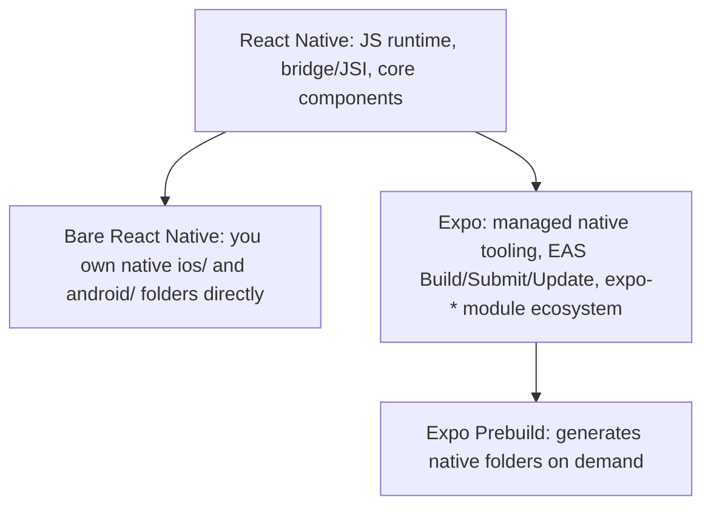
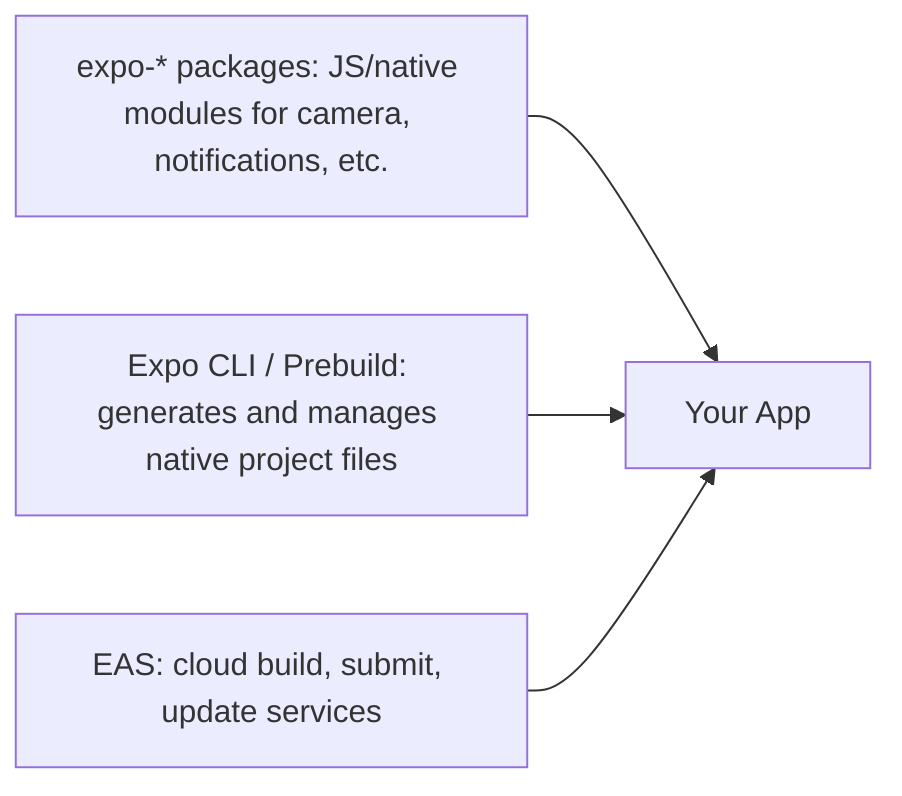
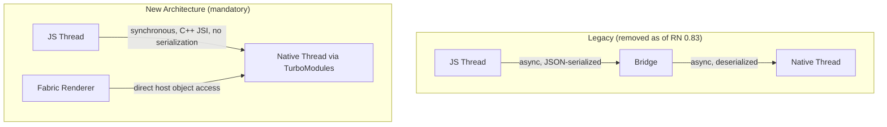
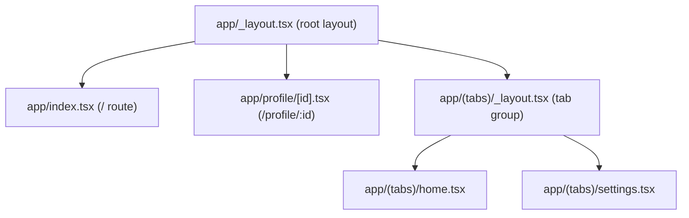

# The Senior Engineer's Guide to Expo (React Native Mobile Dev)

> This guide covers Expo's tooling, mechanism, and production concerns for engineers who already know React and basic React Native (components, `View`/`Text`, navigation concepts). It does not explain what a mobile app is or walk through installing Node. Current as of **Expo SDK 56 (May 2026)**, running on **React Native 0.85 (April 2026)** and **React 19.2**. The New Architecture (Fabric, TurboModules, JSI) became mandatory as of Expo SDK 55 / React Native 0.83 — there is no legacy-architecture opt-out from SDK 55 onward. Version claims were checked against expo.dev/changelog and the React Native ecosystem coverage in July 2026.

## Table of Contents

1. [React Native vs. Expo — What's Actually the Comparison](#comparison)
2. [Concepts — How Expo Actually Works](#concepts)
3. [Which Workflow Do You Need](#decision)
4. [Setup & Current Versions](#setup)
5. [The New Architecture — Mechanism](#new-arch)
6. [Expo Router & Navigation](#router)
7. [Native Modules, Config Plugins, and EAS](#native-modules)
8. [Scaling / Production Concerns](#production)
9. [Security Checklist](#security)
10. [Testing](#testing)
11. [Common Errors & Fixes](#errors)
12. [Anti-Patterns](#anti-patterns)
13. [Quick Reference / Mental Model Cheat Sheet](#cheat-sheet)

---

## 1. React Native vs. Expo — What's Actually the Comparison {#comparison}

This is the comparison senior engineers most often get wrong: **React Native and Expo are not two alternatives at the same layer.** React Native is the underlying framework (the JS-to-native bridge, the component primitives, the renderer). Expo is a toolchain and set of managed services built *on top of* React Native — as of 2026, functionally analogous to what Next.js is to React on the web: you're still writing React Native either way, Expo just owns the build tooling, native project management, and a curated module ecosystem around it.



| Dimension | Bare React Native (no Expo) | Expo (SDK 56 / managed) |
|---|---|---|
| Native project files (`ios/`, `android/`) | You own and edit them directly | Generated on demand via `expo prebuild`; not usually hand-edited |
| Adding a native module | Manual linking, native code edits, Xcode/Android Studio work | `expo install` + config plugins handle most native linking automatically |
| Build infrastructure | You configure Xcode/Gradle/CI yourself, or self-host | EAS Build — cloud builds for iOS/Android without owning a Mac for iOS builds |
| OTA updates (JS-only patches without app store review) | Requires third-party service (e.g., CodePush) or building your own | EAS Update, first-party and integrated |
| New Architecture adoption | Manual — you track RN's migration guides yourself | Expo tracks and ships New Architecture compatibility across `expo-*` packages each SDK release |
| Custom native code (e.g., a bespoke native module Expo doesn't ship) | Fully unconstrained — write anything | Fully possible via **Expo Modules API** or `expo prebuild` + native edits, but you're now maintaining a native layer again |
| When it's the wrong tool | You need heavy, unusual native customization from day one and don't want any managed abstraction | You're fine with 95% of apps' native needs and want to avoid owning native build tooling |

**The actual decision, restated:** the question isn't "React Native or Expo" — it's "bare React Native workflow, or Expo's managed workflow with prebuild as an escape hatch." As of SDK 56, this distinction has narrowed further: `expo prebuild` means even Expo apps can have fully custom native code when needed, generating the native folders on demand rather than committing them — so "Expo can't do X" is rarely true anymore; the real cost is whether you want to *own* the native build pipeline or let EAS manage it.

**Why this matters for a senior engineer's decision, not just a beginner's:** teams that start bare React Native "for control" and later discover they need OTA updates, cloud builds, or a curated native module ecosystem often end up rebuilding what Expo already provides. Conversely, teams with genuinely unusual native requirements (custom Bluetooth stacks, proprietary SDKs with awkward native integration) may still find Expo's abstractions a net cost rather than a convenience, even with prebuild available.

---

## 2. Concepts — How Expo Actually Works {#concepts}

The mental model that matters: Expo is three roughly independent layers, and confusing them is the source of most "is this an Expo problem or an RN problem" debugging confusion.



- **`expo-*` packages** are just React Native native modules, built with the **Expo Modules API** (a Swift/Kotlin-first API for writing native modules that Expo maintains). They're consumable in bare RN projects too — "using Expo" at this layer just means using well-maintained modules, nothing more.
- **Expo CLI / Prebuild** is the part that used to be "managed vs. bare workflow" as a hard fork; as of recent SDKs, `expo prebuild` generates `ios/`/`android/` folders from your `app.json`/`app.config.js` plus config plugins, on demand, rather than you maintaining two permanently divergent workflows. You can commit the generated folders and hand-edit them (functionally bare RN at that point) or regenerate them each build (fully managed).
- **EAS (Expo Application Services)** is the cloud layer: EAS Build compiles your native binaries without you owning Xcode/Gradle CI infrastructure (critical for iOS builds without a Mac), EAS Submit pushes to app stores, and EAS Update ships JS-only OTA patches to already-installed apps, bypassing app store review for non-native changes.

**The vocabulary confusion to resolve:** "managed workflow" as a term from pre-2023 Expo docs is largely obsolete — the mandatory New Architecture and the maturity of prebuild mean the practical spectrum today is "how much do you let Expo regenerate vs. how much do you hand-maintain," not a binary managed/bare choice.

---

## 3. Which Workflow Do You Need {#decision}

| Situation | Recommended approach | Why |
|---|---|---|
| New app, standard mobile feature set (camera, push notifications, maps, auth) | Expo, prebuild-on-demand (don't commit native folders) | Fastest path; `expo-*` covers these; EAS Build removes native CI ownership |
| New app with one or two unusual native SDKs (e.g., a proprietary payment SDK with its own native install steps) | Expo + a custom config plugin, or prebuild with committed native folders for that one integration | You keep EAS/OTA benefits everywhere else while hand-managing the one native piece |
| Existing bare React Native app, considering Expo | Adopt incrementally via `npx install-expo-modules` — you can use `expo-*` packages and EAS without fully adopting prebuild | Migration doesn't require an all-or-nothing switch |
| Heavy, continuous native customization (e.g., a game engine wrapper, deep custom native rendering) | Bare RN, native folders committed and hand-maintained from the start | Prebuild's regeneration model adds friction if native code changes are the majority of your work, not the exception |
| Need OTA JS patches for a compliance-sensitive app (e.g., must ship hotfixes without app store review delay) | Expo + EAS Update | First-party OTA is one of Expo's clearest differentiators over plain bare RN |

---

## 4. Setup & Current Versions {#setup}

Verified against expo.dev/changelog and React Native ecosystem coverage, July 2026:

| Package | Version | Compatibility notes | Last checked |
|---|---|---|---|
| Expo SDK | 56 | Released May 21, 2026; targets React Native 0.85 | July 2026 |
| React Native | 0.85 | Released April 7, 2026; New Architecture is default and assumed stable, not opt-in | July 2026 |
| React | 19.2.x | Matches the web guide's version; RN and web share the same React version line | July 2026 |
| Hermes | Bundled with SDK 56 | Measured ~29% faster app startup, ~38% lower memory, ~25% smaller bundle vs. JSC in recent benchmarks | July 2026 |
| Expo Router | Bundled, now forks its own React Navigation dependencies as of SDK 56 | Direct `@react-navigation/*` imports in an Expo Router project can break — don't import that package directly | July 2026 |

```bash
npx create-expo-app@latest my-app
cd my-app
npx expo install expo@^56
```

**Not fully confirmable / flag it:** third-party native module compatibility with the mandatory New Architecture is not universal — as of early 2026 coverage, roughly 85% of popular RN packages on npm were New Architecture compatible, with the remainder Bridge-only or partially supported. Audit any native-module-heavy dependency before committing to it; don't assume compatibility.

---

## 5. The New Architecture — Mechanism {#new-arch}

The New Architecture is a full replacement of React Native's original bridge-based communication model, and as of SDK 55 / RN 0.83 it's not a togglable feature — the legacy path is removed, not just deprecated.



- **JSI (JavaScript Interface)** replaces the async message-passing bridge with direct, synchronous C++ function calls between JS and native code — no JSON serialization round-trip. This is *why* animation-heavy and native-call-heavy apps see measured gains: the old bridge's async, serialized nature was the actual bottleneck for anything requiring frequent JS↔native communication (gesture handling, live animations).
- **Fabric** is the new UI renderer that replaces the legacy view manager system, built to support React 18+/19 concurrent features (Suspense, transitions) that the legacy renderer had no mechanism for.
- **TurboModules** replace the legacy native module system, loading modules lazily and synchronously via JSI rather than eagerly initializing every native module bridge connection at app startup.

**Why this matters for your code, concretely:** libraries built against the legacy bridge API (older native modules, some pre-2024 third-party packages) may not work at all under RN 0.85+ without an update — this is not a performance regression to tune around, it's a hard compatibility requirement. `react-native-reanimated` v4 and `@shopify/react-native-flashlist` v2 are examples of libraries that dropped legacy-architecture support entirely.

**The interop layer** (still present in RN 0.85 per current guidance) lets some legacy-architecture-authored native modules keep functioning, but it's explicitly described as a bridge-back-compatibility measure, not a long-term target — don't build new code assuming the interop layer as your integration path.

---

## 6. Expo Router & Navigation {#router}

Expo Router is file-based routing for React Native, conceptually parallel to Next.js's App Router: your file structure in `app/` defines your navigation tree.



- **Layered behavior worth making explicit:** a `_layout.tsx` file wraps everything below it in the tree (shared UI like tab bars or headers); a **group** — a folder name in parentheses like `(tabs)` — organizes routes without adding a path segment, letting you apply a shared layout (tabs) to a set of routes that shouldn't be nested under a literal `/tabs/` URL path.
- **The SDK 56 breaking change to know about:** Expo Router now maintains its own fork of the React Navigation dependencies it relies on internally. As a direct consequence, `expo-router` no longer lists `react-navigation` as a direct dependency, and any code directly importing from `@react-navigation/*` in an Expo Router project can break on upgrade — route through Expo Router's own exported navigation hooks/components instead of reaching into React Navigation directly.
- **Deep linking is handled by the same file structure** — a route file's path *is* its deep link path by default, removing the separate linking-config step that manually-configured React Navigation requires.

**One bolded key insight:** treating Expo Router as "just React Navigation with file-based routing sugar on top" is no longer accurate as of SDK 56 — it's now its own navigation implementation that happens to expose a React Navigation-like API surface; don't assume every React Navigation pattern or direct import still works unmodified.

---

## 7. Native Modules, Config Plugins, and EAS {#native-modules}

- **Expo Modules API**: the current recommended way to write custom native modules for an Expo/RN app, using Swift for iOS and Kotlin for Android. It's built New-Architecture-compatible by default — a module written against this API doesn't need separate work to support Fabric/TurboModules, unlike hand-rolled legacy native modules.
- **Config plugins** modify the native project (permissions, Info.plist entries, Android manifest settings) declaratively from `app.json`/`app.config.js`, applied during `expo prebuild`. This is the mechanism that lets you avoid hand-editing generated native files — the plugin re-applies the same change every time the native folders are regenerated, rather than you manually re-editing `Info.plist` after every prebuild wipes it.
- **EAS Build** compiles native binaries in the cloud — critical because iOS builds require a Mac/Xcode, and EAS removes that infrastructure requirement, along with managing signing credentials for you if desired.
- **EAS Update** ships JS-bundle-only changes to already-installed apps without an app store review cycle — but this only covers JS/asset changes; any change requiring a native rebuild (new native module, changed permission, native code edit) still requires a full build and store submission.

**Extension point a senior practitioner should know:** you're not limited to what `expo-*` ships. A config plugin plus the Expo Modules API is the sanctioned way to add fully custom native behavior while staying in the "let Expo manage the build pipeline" model — reaching for a fully bare workflow is only necessary when your native customization is pervasive, not occasional.

---

## 8. Scaling / Production Concerns {#production}

- **Bundle/startup performance**: Hermes (bundled by default) precompiles JS to bytecode, and the measured SDK 56 gains (faster startup, lower memory, smaller bundles, fewer GC pauses) come specifically from Hermes's modernization to handle current JS patterns — not from anything you configure per-app. What you *do* control: lazy-loading rarely-used screens/features, and auditing bundle size for unused dependencies pulled into the JS bundle.
- **OTA update strategy**: EAS Update lets you patch JS-only bugs instantly, but shipping unreviewed logic changes to production without a staged rollout is a real production risk — use EAS Update's channel/branch system to stage updates (internal testers → percentage rollout → full) rather than pushing straight to 100% of users.
- **Native module compatibility audits**: before adding a new native-code-dependent package, confirm New Architecture support explicitly — a package that silently falls back to the interop layer may work in development but degrade performance or break in edge cases in production, since the interop layer is a compatibility shim, not a fully equivalent execution path.
- **Cold start time**: for apps with a large `_layout.tsx` root or heavy synchronous initialization (analytics SDKs, large context providers) at the app root, that work blocks the very first frame — defer non-critical initialization until after the first render, not before it.
- **EAS Build caching**: as of SDK 56-era tooling, the build cache system has been meaningfully improved for faster local and cloud builds — but this depends on cache-invalidation behaving correctly across native dependency changes; a stale cache after a native module version bump is a common source of "it works locally but not on EAS" bugs.

---

## 9. Security Checklist {#security}

- [ ] Never bundle secrets (API keys with write access, signing keys) into the JS bundle — anything in your JS bundle is extractable from the shipped app binary; use a backend proxy for any credential that grants real access.
- [ ] Confirm EAS Update channels are locked down so only your CI/authorized users can push OTA updates — an OTA update pipeline is effectively a remote code deployment path into every installed instance of your app.
- [ ] Audit third-party native modules for maintenance status and known CVEs, especially ones still relying on the legacy-architecture interop layer — an unmaintained native module is a larger attack surface than an unmaintained JS package, since it runs with native OS privileges.
- [ ] Set appropriate `expo-secure-store` (not `AsyncStorage`) for anything sensitive (tokens, credentials) — `AsyncStorage` is unencrypted on-device storage; `expo-secure-store` uses the OS keychain/keystore.
- [ ] Validate deep link / universal link handlers — a file-based route that accepts a deep-linked parameter (e.g., `app/reset-password/[token].tsx`) must validate that parameter server-side, not trust it as pre-authorized because it arrived via a route.
- [ ] Pin config plugin and native dependency versions — an automatically-updated config plugin silently changing a native permission or entitlement during prebuild is a supply-chain risk specific to the plugin model.

---

## 10. Testing {#testing}

- **Component/unit tests** run with Jest + `@testing-library/react-native`, same fundamental gotchas as the web guide's testing section (async state, `act()` warnings) — but native-specific APIs (camera, biometrics, notifications) need mocking at the `expo-*` module level, not the DOM level, since there is no DOM.
- **Native module behavior can't be meaningfully unit tested** — mocking `expo-camera` verifies your code calls the API correctly, not that the camera actually works; that requires device/simulator-level E2E testing (Detox, Maestro).
- **New Architecture changes some native mocking assumptions**: modules built on the Expo Modules API expose a different native binding shape than legacy bridge modules — a test mock written against a legacy-architecture module's shape may not match a New-Architecture-only module's actual call signature, especially for modules exposing synchronous native methods that didn't exist under the bridge model.
- **EAS Build produces different binaries than local Expo Go/dev client testing** — a feature relying on a native module not present in Expo Go (custom native modules, and many `expo-*` modules beyond the Expo Go default set) needs a development build (`expo-dev-client`), not Expo Go, or your test will pass locally and fail to even load the feature in Expo Go.
- **Platform divergence is the gotcha that silently doesn't work**: a test passing on iOS simulator doesn't guarantee Android behavior (and vice versa) — permission dialogs, deep linking, and some Fabric rendering edge cases diverge by platform; CI should run both where the app has platform-specific native code paths.

---

## 11. Common Errors & Fixes {#errors}

| Error | Root Cause | Fix |
|---|---|---|
| `Invariant Violation: TurboModuleRegistry.getEnforcing(...): 'X' could not be found` | A native module isn't linked/available in the current runtime (often Expo Go, which doesn't include every native module) | Use a development build (`expo-dev-client`) instead of Expo Go, or confirm the module supports the New Architecture and is properly installed |
| `Cannot find native module 'ExpoX'` after `expo prebuild` | Config plugin didn't run, or native folders are stale relative to `app.json` | Re-run `expo prebuild --clean` to regenerate native folders from current config |
| App works in dev but crashes on EAS Build production binary only | Dev-only code path relying on Expo Go's broader module availability, or a native dependency not properly declared for production build | Test against a development build (not Expo Go) before assuming parity with EAS Build output |
| `Attempted to import the module "@react-navigation/native" but it is not installed` (SDK 56+) | Expo Router no longer bundles `react-navigation` as a direct dependency | Use Expo Router's own exported hooks/components rather than importing React Navigation directly |
| OTA update via EAS Update doesn't appear on device | Update pushed to a different channel/branch than the installed build is configured to check, or a native change was included (which OTA can't deliver) | Confirm channel/branch alignment; rebuild and resubmit if the change touches native code |
| New Architecture: third-party native module silently no-ops or crashes on specific device | Module hasn't been updated for TurboModules/Fabric and the legacy interop layer only partially covers its API surface | Check the module's changelog for explicit New Architecture support before shipping; consider forking or replacing if unmaintained |

---

## 12. Anti-Patterns {#anti-patterns}

- **Treating Expo Go as equivalent to your production build.** Expo Go is a convenience sandbox with a fixed set of pre-included native modules — shipping code that "works" only because you tested exclusively in Expo Go, without ever building a development client or EAS build, is a common source of last-minute native module surprises.
- **Committing generated native folders and then hand-editing them "just this once,"** without a config plugin to make the change reproducible — the next `expo prebuild` (run by a teammate, or by CI) silently discards the hand-edit, and nobody notices until a build regresses in a way that's hard to trace back to a manually-reverted native file.
- **Assuming a package supports the New Architecture because it's popular or recently updated**, rather than checking its changelog/issues explicitly — popularity doesn't imply New Architecture compatibility, and the mandatory nature of the New Architecture as of SDK 55+ means a Bridge-only package is not a performance tradeoff anymore, it's a hard incompatibility.
- **Reaching for a fully bare React Native workflow "for control" without actually needing pervasive native customization** — teams do this and then rebuild OTA updates, cloud build infra, and native module linking convenience from scratch, solving problems Expo/EAS already solved.
- **Pushing EAS Update changes straight to 100% of users** without a staged rollout, treating OTA the way you'd treat a low-risk config change — an OTA update is a full JS bundle replacement in already-installed apps; a bad update reaches everyone immediately with no app-store-review safety net.
- **Directly importing from `@react-navigation/*`** in an Expo Router SDK 56+ project out of habit from older tutorials — this is now a version-mismatch/missing-dependency risk given Expo Router's own fork.

---

## 13. Quick Reference / Mental Model Cheat Sheet {#cheat-sheet}

```
React Native = the framework (JS runtime, bridge/JSI, core components).
Expo = tooling + managed services on top of React Native (not an alternative to it).
  expo-* packages   = native modules, usable in bare RN too
  Expo CLI/Prebuild = generates ios/ and android/ on demand from app.json + config plugins
  EAS               = cloud build (Build), store submission (Submit), OTA patches (Update)

New Architecture (mandatory as of SDK 55 / RN 0.83):
  JSI          replaces the async Bridge -> synchronous JS<->native calls
  Fabric       replaces the legacy renderer -> supports concurrent React features
  TurboModules replaces legacy native modules -> lazy, synchronous loading

Expo Router: file-based routing. _layout.tsx = shared UI wrapper.
  (group) folders = shared layout without a URL segment.
  SDK 56+: forks its own react-navigation deps -- don't import @react-navigation/* directly.

Decision rule: use Expo unless you have pervasive (not occasional) native
customization needs -- prebuild + config plugins + Expo Modules API cover
custom native code without giving up EAS/OTA benefits.

Never ship EAS Update OTA to 100% without staged rollout.
Never assume Expo Go parity with your production/EAS build.
```

**The one-paragraph mental model:** Expo is not a competing framework to React Native — it's the managed build-and-tooling layer on top of it, roughly the way Next.js relates to React on the web. As of 2026, the mandatory New Architecture means every app (Expo or bare) runs on JSI/Fabric/TurboModules with no legacy fallback, and the real decision an engineer makes isn't "React Native vs. Expo," it's how much of the native build pipeline they want to own directly versus delegate to `expo prebuild` and EAS.

*End of guide.*
