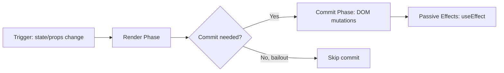
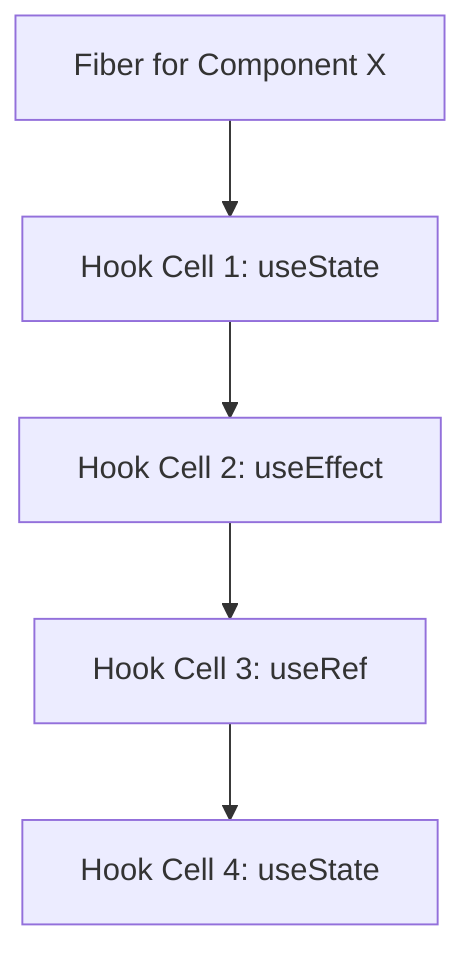
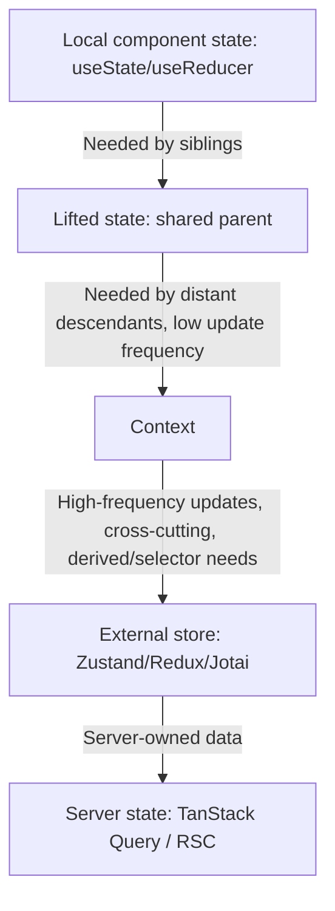
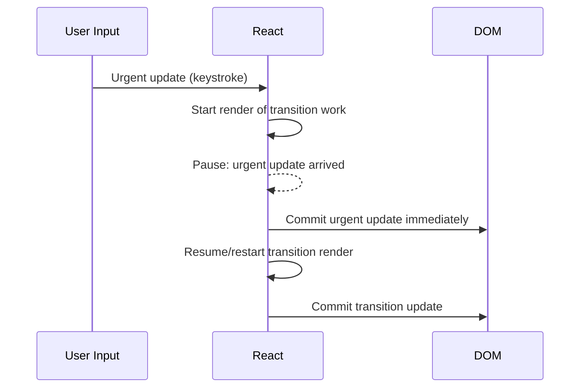
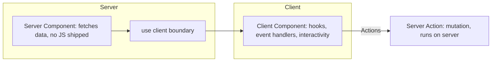
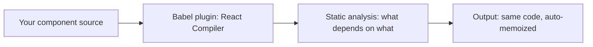

# The Senior Engineer's Guide to React

> This guide covers React's internals, rendering model, and production concerns for engineers who already know JSX, props, and basic hooks. It does not explain what React is or walk through a "hello world" component. Current as of **React 19.2.7 (June 2026)**, with the React Compiler in its stable release (since October 2025) and React Server Components (RSC) standardized as of React 19. Version claims below were checked against react.dev's release notes and changelog in July 2026.

## Table of Contents

1. [Concepts — How Rendering Actually Works](#concepts)
2. [Which Rendering Model Do You Need](#decision)
3. [Setup & Current Versions](#setup)
4. [The Hook Model — Mechanism, Not Magic](#hooks)
5. [State Management: Layers and When Each One Fails](#state-layers)
6. [Concurrent Rendering & Suspense](#concurrent)
7. [Server Components, Actions, and the Server/Client Boundary](#rsc)
8. [The React Compiler](#compiler)
9. [Performance in Production](#performance)
10. [Security Checklist](#security)
11. [Testing React Components](#testing)
12. [Common Errors & Fixes](#errors)
13. [Anti-Patterns](#anti-patterns)
14. [Quick Reference / Mental Model Cheat Sheet](#cheat-sheet)

---

## 3. Concepts — How Rendering Actually Works {#concepts}

React's core job is turning a tree of component calls into a tree of host-environment mutations (DOM nodes, in the browser case), while doing the minimum work to keep the two in sync. The part that trips up experienced engineers isn't JSX or hooks syntax — it's the fact that "render" in React has three distinct phases that get conflated in casual explanation:



- **Render phase**: React calls your component functions to build a new tree of React elements (a lightweight description of UI, not the DOM). This phase must be pure — no side effects — because React may throw this work away, pause it, or run it more than once per commit (this is why Strict Mode double-invokes components in development: it's surfacing impurity bugs before they hit production under concurrent rendering).
- **Reconciliation**: React diffs the new element tree against the previous one (the "Virtual DOM diff"), using stable identity (`key` for lists, component type for elements) to figure out the minimal set of DOM operations required.
- **Commit phase**: React actually mutates the DOM, runs layout effects (`useLayoutEffect`) synchronously before the browser paints, then schedules passive effects (`useEffect`) after paint.

**The key insight most people miss:** because render is decoupled from commit, "a component re-rendered" does not mean "the DOM changed." A parent re-rendering doesn't imply its children's DOM changed — React still diffs first. This is why premature `React.memo` wrapping is often solving a problem that reconciliation was already solving for free; the actual cost of an unnecessary render is the function call and diff, not a guaranteed DOM write.

### Vocabulary that gets used loosely

| Term | What it actually means | Common confusion |
|---|---|---|
| Virtual DOM | The in-memory element tree used for diffing | Not a performance optimization by itself — it's a reconciliation mechanism |
| Reconciliation | The diffing algorithm that decides what changed | Often conflated with "rendering" |
| Fiber | The unit of work React schedules per component instance; holds state, effect list, and priority | Not a "faster virtual DOM" — it's what makes rendering interruptible |
| Commit | The phase where DOM mutations actually happen | People say "rendered" when they mean "committed" |
| Hydration | Attaching event listeners/state to server-rendered HTML without re-creating DOM nodes | Confused with "re-rendering on the client" |

---

## 4. Which Rendering Model Do You Need {#decision}

| Model | When it's the right call | What you give up |
|---|---|---|
| Client-Side Rendering (CSR), plain SPA | Internal tools, dashboards behind auth, apps where SEO/first-paint don't matter | Slower Time-to-Interactive on cold load; no content for crawlers without extra work |
| Static Site Generation (SSG via Next.js/Astro) | Marketing sites, docs, blogs — content known at build time | Any per-request personalization requires client-side fetch or ISR |
| Server-Side Rendering (SSR), no RSC | You need fast first paint and personalization, but your framework/host doesn't support RSC yet | You still ship full component JS to the client; server does render work per request |
| React Server Components (RSC) | Data-heavy pages where you want zero client JS for non-interactive parts, and you're on Next.js App Router (or another RSC-capable meta-framework) | Adds a mental model layer (server/client boundary); not all libraries are RSC-compatible yet |
| React Native / Expo | Mobile, not web — see the separate Expo guide | Different renderer, different host APIs entirely |

**The question to ask first isn't "which is more modern" — it's "does any part of this page not need interactivity."** If most of a page is data display and only a fraction is interactive (a comment box, a filter toggle), RSC lets you ship JS only for that fraction. If the whole page is inherently interactive (an editor, a canvas app, a dashboard with live-updating widgets), plain CSR with a client-rendered SPA is simpler and the RSC boundary buys you little.

---

## 5. Setup & Current Versions {#setup}

Verified against react.dev/versions and the React blog, July 2026:

| Package | Version | Notes | Last checked |
|---|---|---|---|
| `react` / `react-dom` | 19.2.7 | Latest patch on the 19.2 line; 19.0 and 19.1 lines still receive security patches | July 2026 |
| React Compiler | Stable (shipped Oct 7, 2025) | No longer "experimental" — safe to adopt in production; still opt-in via Babel plugin or framework integration | July 2026 |
| Next.js (App Router, RSC) | 15.x line as of this writing supports React 19 | Confirm your specific Next.js minor version supports 19.2's `Activity` and `useEffectEvent` before relying on them | July 2026 |
| Node.js | 20.x LTS or 22.x | Required for modern tooling (Vite, Next.js) | — |

**Security note (verified):** React Server Components had a critical unauthenticated RCE vulnerability disclosed December 3, 2025, patched in 19.0.1, 19.1.2, and 19.2.1. If your project pre-dates this, upgrade immediately — this isn't a theoretical "not fully confirmable" item, it's a confirmed critical patch. Two additional related vulnerabilities were disclosed and patched shortly after (December 11, 2025).

```bash
npm install react@19.2.7 react-dom@19.2.7
```

---

## 6. The Hook Model — Mechanism, Not Magic {#hooks}

Hooks aren't syntactic sugar — they're a linked-list-per-fiber mechanism. Each fiber (component instance) holds an ordered list of hook state cells. On every render, React walks that list in call order and matches the Nth hook call to the Nth cell. This is the entire reason for the "rules of hooks":



If a hook call is conditional, the Nth call in one render might correspond to a different hook cell than the Nth call in the next render — React has no way to detect this by name, only by position. **This is why conditional hooks corrupt state silently instead of throwing immediately in every case** — the mismatch is positional, and depending on the hook types involved, React may not notice until state that looks like it belongs to one thing is actually holding a stale value from a different hook's cell.

### The hooks worth understanding at the mechanism level

**`useState` vs `useReducer`** — both are the same underlying mechanism (a queue of pending updates attached to a fiber's hook cell). `useReducer` isn't "useState for complex state" as a stylistic choice; it exists because when update logic depends on the *previous* state in ways that involve multiple sub-values changing together, colocating that logic in a pure reducer function makes it testable independent of rendering, and prevents the bug class where two separate `setState` calls derived from stale closures produce an inconsistent combined state.

**`useEffect` vs `useLayoutEffect`** — the layering is about *when* your effect runs relative to the browser paint:

| Layer | Timing | What it can't do that the next layer handles |
|---|---|---|
| `useEffect` | After paint, asynchronously | Can't prevent a visual flash — the browser has already painted the "wrong" frame |
| `useLayoutEffect` | Synchronously, after DOM mutation, before paint | Blocks paint — can't be used for anything expensive without causing jank |
| `useEffectEvent` (19.2) | Lets you read latest props/state inside an effect without re-triggering the effect | Doesn't replace effects — it's specifically for the "I need current values but don't want this in the dependency array" case that people used to solve by lying to the linter |

**`useEffectEvent` (new in 19.2)** solves a real, common bug: an effect that subscribes to a WebSocket and needs to call a callback prop, where including that callback in the dependency array causes the effect to re-subscribe every time the parent re-renders with a new function identity. Before 19.2, the "fix" was usually a `useRef` holding the latest callback, manually kept in sync — `useEffectEvent` formalizes that pattern.

**`useTransition` / `useDeferredValue`** — these exist specifically to let you mark some state updates as low-priority, so React can interrupt them to handle a more urgent update (like a keystroke) first. Without them, a large re-render triggered by, say, a search-as-you-type feature blocks the input field itself from feeling responsive, because React processes updates in the order they're scheduled with no way to know one is more urgent.

```jsx
const [isPending, startTransition] = useTransition();
const [query, setQuery] = useState('');

function handleChange(e) {
  setQuery(e.target.value); // urgent: keep the input responsive
  startTransition(() => {
    setSearchResults(filterHugeList(e.target.value)); // low priority
  });
}
```

**`Activity` (new in 19.2)** — lets you keep a subtree mounted (preserving its state and DOM) while visually hiding it, instead of unmounting. This targets the specific problem of tab interfaces and off-screen routes where remounting loses scroll position, form input, and component state, and where the alternative (manually hoisting state up to survive unmounts) was a common but awkward workaround.

**One bolded key insight:** hooks encode *order-dependent state*, not name-dependent state — every rule about hooks (no conditionals, no loops, no early returns before hooks) follows directly from that one fact.

---

## 7. State Management: Layers and When Each One Fails {#state-layers}

State management in React is genuinely layered — each layer solves a problem the layer below it can't, and reaching for a heavier layer than the problem requires is the single most common source of unnecessary complexity in React codebases.



- **Local state** breaks down the moment two sibling components need the same value — there's no mechanism for siblings to read each other's local state, so you lift it.
- **Lifted state** breaks down when the components that need the value are far apart in the tree — prop drilling through five layers of components that don't use the value themselves is the practical wall that Context exists to solve.
- **Context** breaks down under high-frequency updates: every consumer of a context re-renders on any change to the context value, with no built-in selector mechanism. A context holding `{ user, theme, notifications }` where `notifications` updates every second will re-render every consumer of `user` and `theme` too, because Context has no concept of "which part of this value did you actually read."
- **External stores** (Zustand, Jotai, Redux with `useSelector`) solve exactly that: subscription happens at the *slice* level, so a component only re-renders when the specific piece of state it reads changes, regardless of update frequency elsewhere in the store.
- **Server state** (TanStack Query, SWR, or RSC's server-owned fetching) is a fundamentally different problem from client state — it has its own lifecycle (stale, fetching, error, cached) that generic client state managers don't model. Using `useState` + `useEffect` to fetch and store server data is possible but reimplements caching, deduplication, and race-condition handling that these libraries already solve.

**The mistake experienced engineers still make:** reaching for Redux/Zustand for state that's actually server-owned data. If the data came from an API and your app doesn't own its source of truth, that's server state, not client state — trying to keep it "fresh" by hand (manual refetch logic, manual invalidation) is solving a problem TanStack Query or RSC already solves.

---

## 8. Concurrent Rendering & Suspense {#concurrent}

Concurrent rendering is the mechanism that makes `useTransition`, `Suspense`, and interruptible rendering possible — but it fundamentally changes a guarantee that React 17 and earlier gave you: that render is synchronous and atomic. In concurrent mode, React can start rendering, pause partway through, throw the work away, and start over — which means your render-phase code must not only be pure, it must be safely re-runnable.



**Suspense** is the mechanism for declaratively handling "this part of the tree isn't ready yet" — for data fetching, code-split chunks (`React.lazy`), or streaming SSR/RSC content. The mechanism: a component "throws" a promise during render; the nearest `Suspense` boundary above it catches that promise, shows its fallback, and re-renders the subtree once the promise resolves.

```jsx
<Suspense fallback={<Skeleton />}>
  <ProfileDetails /> {/* may suspend while fetching */}
</Suspense>
```

**Why this design over a `loading` boolean per component:** colocating loading state with the component that needs it (rather than lifting a `isLoading` flag) means you don't need to manually wire loading booleans through every level between where data is fetched and where the boundary should show a fallback — the nearest ancestor `Suspense` catches it automatically, and you control granularity purely by where you place boundaries.

**The layering that matters in production:** a single top-level `Suspense` around your whole app means *any* suspending component blanks the entire UI to a fallback — including a small "reload this section" retry. Nested boundaries let unrelated parts of the page stay interactive while only the specific suspending subtree shows a fallback. Placement of Suspense boundaries is a UX decision, not just a technical requirement.

---

## 9. Server Components, Actions, and the Server/Client Boundary {#rsc}

RSC is the most conceptually different thing in React 19 for engineers coming from a pre-19 mental model, because it introduces two categories of component that look identical in JSX but execute in entirely different environments.



- **Server Components** (the default in an RSC-enabled framework) run only on the server, can access backend resources directly (databases, filesystem, secrets), and produce zero client-side JavaScript — their output is serialized and streamed to the client as part of the RSC payload, not re-executed there.
- **Client Components** (marked `"use client"`) are what you already know from pre-19 React — they run in the browser, can use hooks, state, and event handlers.
- **The boundary is one-directional**: a Server Component can render a Client Component, but a Client Component cannot import and render a Server Component directly (it can only receive one as a `children` prop that was already rendered on the server). This asymmetry exists because once you're in client-rendered territory, there's no mechanism to "reach back" to the server mid-render — the server work already happened before the payload was sent.

**Actions** (`"use server"` functions, or the `action` prop on `<form>`) are the mutation-side counterpart: they let a client component trigger server-side code (e.g., a database write) without you hand-rolling a REST endpoint and a `fetch` call. `useFormStatus` and `useOptimistic` exist specifically to make the UI around actions feel instant — `useOptimistic` lets you render an assumed-successful state immediately while the action is in flight, and roll back automatically if it fails.

```jsx
// Server Component (no "use client" directive — server by default)
async function ProductPage({ id }) {
  const product = await db.products.find(id); // direct DB access, never shipped to client
  return <ProductClientView product={product} />;
}

// Client Component
"use client";
function ProductClientView({ product }) {
  const [optimisticQty, setOptimisticQty] = useOptimistic(product.qty);
  async function addToCart(formData) {
    setOptimisticQty(q => q + 1);
    await addToCartAction(formData); // Server Action
  }
  return <form action={addToCart}>...</form>;
}
```

**Why this design over a bespoke API layer:** it removes an entire category of boilerplate (defining an endpoint, writing a client-side fetch wrapper, wiring loading/error state by hand) for the common case of "a form submission needs to mutate server data," while still letting you write a real API layer for cases that need it (public APIs, third-party consumption).

**Not yet fully confirmable:** RSC adoption outside Next.js's App Router is still uneven — other meta-frameworks (Waku, TanStack Start, Redwood) support it to varying degrees, and plain Vite/CRA-style SPAs have no RSC story at all. If you're not on a framework with first-class RSC support, this section doesn't apply to you yet, and reaching for RSC patterns without framework support will not work.

---

## 10. The React Compiler {#compiler}

The Compiler (stable since October 7, 2025) is a build-time tool that automatically memoizes components and values — its entire purpose is to make `useMemo`, `useCallback`, and `React.memo` unnecessary for the common case of "prevent this expensive recalculation or child re-render," without you writing the memoization by hand.

**Why this over teaching everyone to memoize correctly:** manual memoization has a well-known failure mode — a `useCallback` with an incomplete or wrong dependency array either does nothing (defeats the optimization) or introduces a stale-closure bug (correctness issue), and reviewing dependency arrays by hand doesn't scale across a large team. The compiler analyzes your component's data flow statically and inserts the equivalent of `useMemo`/`useCallback` only where it can prove doing so is both correct and beneficial — removing the dependency-array footgun entirely for compiler-covered code.



**What it can't do:** the compiler bails out silently on code patterns it can't prove are safe to memoize (mutating props/state directly, refs read during render, certain third-party hook patterns) — it doesn't throw an error, it just skips optimizing that component, which means adopting the compiler doesn't retroactively fix badly-written impure components; it only removes the *manual memoization* need for otherwise-correct code.

**One bolded key insight:** the compiler is not a substitute for the Rules of React (purity, no mutation during render) — it *requires* your code already follow them to do its job; violating those rules doesn't just risk bugs anymore, it silently disables an optimization you're relying on.

---

## 11. Performance in Production {#performance}

What changes between a demo and production load is almost always **list rendering, bundle size, and re-render cascades** — not the framework's baseline speed.

- **List rendering**: for lists beyond a few hundred rows, virtualization (rendering only visible rows, via `react-window` or `@tanstack/react-virtual`) is not optional — React reconciling thousands of off-screen DOM nodes on every state change is the single most common production performance complaint, and it's a data-structure problem, not something `memo` fixes.
- **Bundle size / code-splitting**: `React.lazy` + `Suspense` at route boundaries (or component boundaries for heavy, rarely-used UI like a rich text editor) is what actually moves Time-to-Interactive — shipping your entire app's JS on first load doesn't get faster because a component is "fast," it gets faster because less JS is parsed and executed before the page is usable.
- **Re-render cascades**: the specific failure mode is a state update high in the tree causing every descendant to re-render even when most of them don't read the changed state. The fix, in order of preference: (1) push state down to where it's actually used (2) split context by update frequency (3) `React.memo` on components that are expensive to re-render *and* whose props are usually referentially stable (4) let the Compiler handle it if you've adopted it.
- **Images and third-party scripts**: outside pure-React concerns but the actual bottleneck in most real apps — a perfectly optimized component tree still ships a slow page if you're loading unoptimized images or blocking third-party analytics scripts synchronously.

**Concrete, not "cache it":** for server state, cache by query key with a `staleTime` matched to how often the underlying data actually changes (a user's own profile: minutes; a live stock price: seconds/never-cache) — the failure mode of not doing this is either stale data shown as fresh, or redundant network requests hammering your API on every component mount.

---

## 12. Security Checklist {#security}

- [ ] Never render user-controlled HTML via `dangerouslySetInnerHTML` without sanitizing it first (DOMPurify or equivalent) — this is React's one deliberate escape hatch from its default XSS protection, and it's opt-in for a reason.
- [ ] Confirm you're on a patched React version (19.0.1 / 19.1.2 / 19.2.1 or later) — the December 2025 RSC RCE affects unpatched Server Components setups specifically.
- [ ] Never pass secrets or credentials as props into a Client Component from a Server Component — anything passed across the server/client boundary is serialized and shipped to the browser, visible in the RSC payload.
- [ ] Validate and authorize inside every Server Action — an Action is a callable server endpoint; it does not automatically inherit the auth checks of the page that renders it.
- [ ] Audit third-party npm packages for known CVEs before adding them (`npm audit`), especially anything touching `dangerouslySetInnerHTML`-adjacent rendering (markdown renderers, rich text editors).
- [ ] Don't trust `NODE_ENV=production` alone to strip dev-only warnings/tools — confirm your bundler is actually dead-code-eliminating dev branches (React DevTools hooks, PropTypes checks) in the shipped bundle.
- [ ] Set a Content Security Policy that accounts for any inline scripts your framework injects (Next.js hydration scripts, etc.) rather than defaulting to `unsafe-inline`.

---

## 13. Testing React Components {#testing}

The non-obvious gotchas are almost all about **async state and concurrent rendering interacting badly with naive test setups**:

- **`act()` warnings are signal, not noise.** If React logs "an update wasn't wrapped in act()," it means a state update happened outside the test framework's awareness of React's commit cycle — usually a `useEffect` firing after your assertion already ran. Testing Library's `render`/`fireEvent`/`userEvent` wrap this for you; raw `ReactDOM.render` + manual DOM events do not.
- **Suspense in tests requires an explicit await point.** A component that suspends on data fetching won't resolve synchronously in a test — use `findBy*` queries (which return promises and retry) rather than `getBy*` (synchronous, will fail before the suspended promise resolves).
- **Server Components can't be unit-tested with client-side testing tools** (React Testing Library renders in a browser-like DOM environment; Server Components never run there in production). Test them via integration/E2E tests (Playwright/Cypress against a running server) or via framework-specific test utilities, not `render()`.
- **Mocking `fetch` inside Server Components** requires mocking at the network layer your test runner actually intercepts (e.g., MSW configured for Node, not just browser) — a browser-only mock won't catch a server-side fetch.
- **The Compiler changes almost nothing about testing** — it's a build step, so as long as your test pipeline runs the same Babel config as your build, tests exercise compiled output. Skipping the compiler plugin in test config means you're testing different code than you ship.

---

## 14. Common Errors & Fixes {#errors}

| Error | Root Cause | Fix |
|---|---|---|
| `Rendered more hooks than during the previous render` | A hook call became conditional (an early return before a hook, or a hook inside an `if`) | Move all hooks above any conditional return; use conditional logic *inside* the hook instead |
| `Cannot update a component while rendering a different component` | Calling `setState` synchronously during another component's render phase (not inside an effect or event handler) | Move the state update into a `useEffect` or event handler |
| `Objects are not valid as a React child` | Rendering an object (often an error object, or a Date, or a raw API response) directly in JSX | Render a stringified/derived value, not the object itself |
| `Hydration failed because the server rendered HTML didn't match the client` | Client and server produced different output — commonly `Date.now()`, `Math.random()`, or `typeof window` branching used during render | Move non-deterministic values into `useEffect` so they only apply after hydration, or use `suppressHydrationWarning` deliberately for known-safe cases |
| `A component suspended while responding to synchronous input` | A `startTransition`-wrapped update triggered a Suspense fallback in response to something React expected to be low-priority-safe, but no boundary was ready | Wrap the suspending update explicitly in `startTransition`, or ensure a `Suspense` boundary exists above the suspending component |
| `Maximum update depth exceeded` | A `useEffect` sets state unconditionally with no dependency guard, re-triggering itself every render | Add a proper dependency array, or restructure so the effect doesn't need to re-run on the value it sets |

---

## 15. Anti-Patterns {#anti-patterns}

- **Deriving state from props into `useState` and calling it done.** Storing `useState(props.value)` and never syncing it means the component silently ignores prop updates after mount — the classic "why isn't my component updating" bug that stems from confusing "initial value" with "always in sync."
- **`useEffect` as a general-purpose "run this after render" hammer**, including using it to synchronize two pieces of state that could just be computed together during render. If you can compute a value from existing state/props during render, you don't need an effect and a second state variable to hold the derived value.
- **Wrapping everything in `React.memo` reflexively**, without checking whether the component's props are usually referentially stable. `memo` on a component that receives a new inline object/function prop every parent render does nothing but add a comparison cost — this is more common now that the Compiler exists, because engineers still hand-add memoization the Compiler would have handled correctly.
- **Fetching in `useEffect` with manual loading/error state** instead of using a data-fetching library — this reimplements caching, deduplication, and race conditions (the classic bug: a fast second request resolves before a slow first request, and the first request's stale response overwrites the correct one because nothing canceled it).
- **Treating Context as a general state manager** for frequently-updating values, then wondering why unrelated parts of the tree re-render on every keystroke of an unrelated form.
- **Marking components `"use client"` reflexively at the top of every file** in an RSC project "to be safe" — this defeats the entire purpose of RSC by shipping JS for components that never needed to be interactive, and it's an easy trap for teams migrating from pre-19 mental models where everything was implicitly a client component.

---

## 16. Quick Reference / Mental Model Cheat Sheet {#cheat-sheet}

```
Render phase: pure, can run more than once, no side effects.
Commit phase: DOM mutations happen here, once.
Effects: useLayoutEffect (before paint, blocking) -> paint -> useEffect (after paint).

Hooks = ordered list per fiber. Never conditional. Never in loops/early-returns.

State layers, cheapest to most powerful:
  useState -> lifted state -> Context (low-frequency) -> external store (high-frequency)
  -> server state library (server-owned data)

Suspense: nearest boundary catches a thrown promise. Place boundaries for UX, not just correctness.

RSC: Server Components = no client JS, direct backend access, one-directional boundary.
     Client Components = "use client", interactive, hooks.
     Actions = "use server", mutation entrypoint from client.

Compiler: auto-memoizes provably-safe pure code. Requires Rules of React. Silently
skips code it can't prove safe — doesn't replace understanding purity.
```

**The one-paragraph mental model:** React turns component calls into a tree, diffs trees to minimize DOM writes, and — as of 19 — lets you choose where code executes (server vs. client) and how urgently an update should be processed (transition vs. immediate). Everything else (hooks rules, Suspense placement, state-layer choice, memoization) is a consequence of those three facts, not an independent set of rules to memorize.

*End of guide.*
